# Lodia 产品需求文档 PRD

版本：v0.5
日期：2026-05-07
状态：中国区独立运营版 / LLM 长程任务数据聚焦版 / MVP 到企业级数据产品路线
产品定位：中国区 LLM 长程任务数据资产平台 / LLM Long-Horizon Task Data Platform

## 1. 一句话定位

Lodia 是一个 LLM 长程任务数据资产平台，帮助用户一键把 AI 对话中的复杂任务执行记录、Agent trace、代码任务、工具调用、验收过程和复盘案例沉淀为可复用、可评估、可授权、可持续变现的数据资产。

品牌含义：

> Lodia 源自 Lode 的“矿脉、价值来源”意象，代表从分散的 AI 工作记录中发现、提炼和认证高价值数据资产。

对外主张：

> 一键把 LLM 长程任务变成可复用、可变现的数据资产。

扩展说明：

> 用户只需转发或上传 LLM 对话、Agent 执行记录、代码修复任务、企业流程任务和评测复盘，Lodia 自动完成隔离、脱敏、去重、结构化、长程任务证据评分、标注、审核和数据集生成。优质 Case 被采纳、授权或进入训练/评测数据集后，贡献者可以获得收益。

当前聚焦：

- 只建设 LLM 长程任务高质量数据。
- 暂不建设泛图片、音频、视频、普通闲聊、单轮问答、通用文本或知识库切片数据。
- 附件只作为长程任务 Case 的证据补充，不作为独立数据产品。

产品模块命名：

- Lodia Inbox：LLM 对话、Agent trace、代码任务和评测复盘的一键收集入口。
- Lodia Pipeline：脱敏、解析、去重、结构化、长程任务证据评分、自动标注和质量门禁处理链。
- Lodia Gold：高质量长程任务训练数据集和 gold eval 数据集。
- Lodia Ledger：CaseID、授权、使用记录和贡献者收益分账账本。
- Lodia Eval：面向模型、Agent 和企业 AI 流程的长程任务评测数据与评测服务。

### 1.1 中国区独立运营定义

本版本将 Lodia 定位为 **中国区独立运营产品**，默认只面向中国大陆用户、企业客户和数据使用方提供服务。

中国区独立运营意味着：

- 中国区使用独立法人、独立域名、独立备案、独立云资源和独立运维团队。
- 中国区用户数据、原始 Case、脱敏 Case、标注结果、日志、审计记录、模型调用内容、账单和收益记录默认全部在中国大陆境内存储和处理。
- 中国区不调用境外 LLM、OCR、ASR、向量数据库、日志、客服、监控、分析、邮件营销或工单 SaaS 处理用户数据。
- 中国区不与海外版共享数据库、对象存储、KMS、日志、模型供应商、数据集市场和贡献者账本。
- 中国区任何数据出境必须默认阻断，只有在完成专门的法律评估、用户告知、单独同意、出境机制和审批后才能例外放行。
- 中国区 MVP 不做公开跨境数据交易，不向海外客户交付含中国用户数据的数据集。

## 2. 背景与机会

AI 对话和 Agent 任务正在成为新的高价值数据来源。个人、企业员工、AI 产品团队、客服团队、销售团队、研发团队每天都在与 AI 产生大量真实交互，但这些交互通常是一次性的：用完即走，分散在 ChatGPT、Kimi、Claude、Codex、Cursor、飞书、钉钉、邮件、客服系统、浏览器任务和本地文件中。

这些数据中包含大量可复用价值：

- 高质量用户问题
- 高质量 AI 回答
- 成功任务路径
- 失败案例和边界样本
- Agent 工具调用过程
- 真实行业问题
- 用户反馈和验收结果
- 可用于评测、训练、知识库和业务培训的案例

但当前痛点明显：

- 数据入口分散，收集成本高
- 对话和任务记录缺少统一结构
- 原始数据包含隐私和商业机密，不能直接复用
- 优质 Case 难以筛选、标注和定价
- 数据贡献者无法从高质量 Case 中获得持续收益
- 企业缺少可审计、可撤回、可授权的数据资产账本
- AI 团队缺少来自真实任务的高质量评测集和训练集

Lodia 的机会在于：用“邮箱/收件箱”作为最低摩擦入口，用自动脱敏和自动标注把原始 AI 交互转化为可信、可追踪、可交易的数据资产。

## 3. 产品目标

### 3.1 用户价值目标

- 让个人和团队可以一键沉淀 AI 使用过程中的高价值 Case。
- 让贡献者因优质 Case 被采纳、授权或使用而获得收益。
- 让 AI 产品团队快速获得真实、高质量、已标注、可追踪的数据集。
- 让企业把内部 AI 使用经验沉淀为案例库、评测集、知识库和 SOP。
- 让数据在进入复用和交易前完成脱敏、授权、去重、质检和审计。

### 3.2 商业目标

- 建立 AI Case 数据资产供给网络。
- 形成面向企业和 AI 团队的数据集订阅、数据包销售、API 调用和企业私有化收入。
- 通过 CaseID、Dataset Manifest 和 Usage Ledger 建立可审计的贡献者分账系统。
- 最终形成垂直行业 AI 数据资产市场。

### 3.3 产品原则

- 隐私优先：原始数据默认隔离，脱敏后才进入标注和审核。
- 数据可追踪：每条 Case 必须有来源、授权、版本、使用记录和收益记录。
- 自动优先，人审兜底：自动解析、自动脱敏、自动标注，人类只处理高价值和高风险样本。
- 自动标注不等于商用准入：自动标注结果只能进入候选层，不能直接进入可商用数据集、可训练数据集或 gold eval。
- 数据分级交付：每条 Case 必须有 Data Readiness Level，不同用途对应不同最低等级。
- 数据集产品化：每个可交付数据集必须包含 Data Contract、Dataset Manifest 和 Quality Report。
- 不承诺不可证明的归因：可以追踪“被纳入数据集/评测/RAG/训练任务”，不承诺追踪“模型某次回答是否直接使用了某条 Case”。
- 重复数据不简单删除：重复 Case 需要聚类、降权、合并，并转化为高频需求信号。
- 中国区数据不出境：默认阻断原始数据、脱敏数据、日志、模型调用内容、向量和数据集出境。
- 合规先于变现：未完成来源、授权、隐私、内容安全和数据等级检查的 Case，不得进入商业化数据集。

## 4. 目标用户

### 4.1 Case 贡献者

包括 AI 重度用户、咨询顾问、开发者、客服人员、销售人员、运营人员、培训师、垂直行业专家。

核心诉求：

- 快速提交日常 AI 对话和任务记录
- 不想手工整理数据
- 希望优质案例被采纳后获得收益
- 希望保护隐私和客户信息
- 希望建立个人 AI Case 资产库

### 4.2 AI 产品团队

包括 Agent 产品、AI 应用、模型应用、LLMOps 团队、创业公司。

核心诉求：

- 获取真实用户问题和任务样本
- 构建评测集、训练集、失败案例库
- 观察模型或 Agent 在真实任务中的表现
- 快速发现高频问题、失败模式和边界案例
- 需要合法、脱敏、可审计的数据来源

### 4.3 企业客户

包括客服、销售、财务、采购、法务、HR、外贸、研发和企业 AI 中台团队。

核心诉求：

- 把员工 AI 使用经验沉淀为内部案例库
- 构建私有评测集和知识库
- 保障隐私、权限、审计、合规
- 不希望原始敏感数据进入第三方云端
- 需要私有化、SSO、RBAC、企业词库和数据保留策略

### 4.4 审核与标注人员

包括平台内部审核员、企业数据管理员、行业专家。

核心诉求：

- 只看脱敏后的 Case
- 快速确认标签、价值、风险和授权状态
- 处理疑似重复、疑似高风险、疑似高价值 Case
- 建立 gold dataset

### 4.5 数据购买方

包括 AI 公司、企业培训团队、客服系统厂商、Agent 平台、行业 SaaS、研究机构。

核心诉求：

- 购买高质量、已脱敏、已授权、可追踪的数据集
- 按行业、任务类型、难度、质量、数据用途筛选
- 获得导出格式、API、授权证明和数据集清单
- 需要持续更新的数据源

## 5. 核心概念定义

| 概念 | 定义 |
| --- | --- |
| Case | 一次 AI 对话、任务、案例或评测过程的标准化数据资产单元 |
| Asset | Case 关联的图片、PDF、视频、音频、代码、日志、附件等多模态文件 |
| Trace | Agent 或工具执行过程，包括 function call、浏览器操作、终端命令、API 返回 |
| Annotation | 对 Case 的标签、评分、风险识别、审核结论和用途建议 |
| Dataset | 由多个 Case 组成的训练集、评测集、案例库、知识库或行业数据包 |
| CaseID | 每条 Case 的唯一资产 ID，用于追踪、授权、使用和分账 |
| CaseCluster | 相似或重复 Case 的聚类，用于去重、频次统计和收益降权 |
| UsageEvent | Case 被加入数据集、导出、调用、检索、训练纳入等可审计事件 |
| PayoutEvent | 基于 UsageEvent 和分账规则生成的收益事件 |
| Redacted Case | 经过脱敏、泛化、清洗后的可处理 Case |
| Raw Quarantine | 原始数据隔离区，原始隐私数据只在此短期存在 |
| Dataset Manifest | 数据集清单，记录数据集包含的 CaseID、版本、授权和用途 |
| Data Readiness Level | 数据可用等级，定义 Case 可用于私有库、商用、训练或 gold eval 的最低标准 |
| Quality Gate | 数据质量门禁，检查 schema、隐私、授权、去重、正确性、可用性和审核状态 |
| Data Contract | 数据集交付合同，定义字段、标签、最低等级、授权范围、禁止用途和质量阈值 |
| Quality Report | 数据集质量报告，披露样本分布、DRL 分布、人审比例、去重策略和已知限制 |
| Source Trust Score | 来源可信度评分，用于识别刷量、投毒、搬运和低可信贡献者 |

## 6. 产品范围

### 6.1 MVP 范围

MVP 要验证一个核心闭环：

> 用户提交 AI 对话/任务记录 -> Lodia 自动脱敏、结构化、去重、标注 -> 人工审核 -> 生成可导出的数据集 -> 记录 CaseID 和使用事件。

MVP 功能包括：

- 专属 Lodia Inbox 收件地址
- 邮件转发入口
- 文件上传入口
- AI 对话正文解析
- 常见附件解析：Markdown、HTML、TXT、JSON、PDF、图片
- Raw Quarantine 原始隔离区
- 自动隐私识别与脱敏
- 二次残留扫描
- 原始数据 TTL 删除
- 标准 Case schema
- raw_hash、canonical_hash、embedding 去重
- CaseCluster 聚类
- 自动标签和质量评分
- Data Readiness Level 数据可用等级
- Quality Gate 质量门禁
- 人工审核工作台
- 训练集、评测集、案例库三类数据集
- Data Contract 和 Quality Report
- JSONL、CSV、Markdown 导出
- Usage Ledger 基础使用记录
- 贡献者基础奖励规则
- 中国区独立部署与中国大陆云资源
- ICP 备案/许可证评估入口
- 公安联网备案准备材料
- 等保二级基线设计，企业版按等保三级预留
- 个人信息处理规则、贡献者授权协议、数据购买方协议
- 个人信息查阅、复制、更正、删除、撤回同意、注销账号流程
- 数据分类分级、重要数据候选识别和出境阻断策略
- 国内模型供应商白名单和委托处理记录
- 中国区合规审计日志和合规报表

### 6.2 MVP 暂不做

- 完整公开数据交易市场
- 自动打款和税务处理
- 复杂链上确权
- 训练后模型回答级归因
- 全量私有化部署
- 多租户企业级细粒度权限完整实现
- 视频长内容深度理解
- 自动标注直接进入可训练或 gold eval 数据集
- 医疗、金融、未成年人等高敏公开数据集
- 中国区和海外区数据互通
- 向海外客户交付中国用户贡献的数据集
- 使用境外模型或境外 SaaS 处理用户数据
- 未完成备案、等保和核心协议前开放大规模公开注册
- 对外宣传“完全匿名化”“零隐私风险”等不可证明承诺
- 面向公众提供未备案或未评估的生成式 AI 内容生成服务

## 7. 核心用户旅程

### 7.1 贡献者提交 Case

1. 贡献者获得专属 Lodia Inbox 地址，例如 `u123@inbox.lodia.ai`。
2. 用户从 ChatGPT、Kimi、Claude、Codex、Cursor 或其他工具中导出对话/任务记录。
3. 用户转发邮件或上传文件到 Lodia。
4. 系统进入 Raw Quarantine，自动识别文件类型、来源平台和内容结构。
5. 系统完成自动脱敏、去重、标注和质量评分。
6. 用户在贡献者页面查看脱敏结果、授权状态、价值评分和是否进入审核。
7. Case 被采纳后进入个人资产库和平台候选数据集。

### 7.2 自动脱敏与风险控制

1. 原始上传进入隔离区，不进入普通数据库、搜索索引、训练系统或人工审核台。
2. 系统解析文本、附件、图片 OCR、PDF 内容和必要元数据。
3. PII、密钥、商业机密、合同、客户信息、高敏信息被识别。
4. 系统根据策略执行删除、替换、泛化或拒收。
5. 脱敏后进行二次残留扫描。
6. 通过扫描的 Case 生成 Redacted Case。
7. 原始数据按风险等级立即删除或 TTL 删除。

### 7.3 去重与聚类

1. 系统对原始文件生成 raw_hash。
2. 对结构化内容生成 canonical_hash。
3. 对核心问题、回答和任务结果生成 embedding。
4. 命中完全重复时标记为 exact_duplicate。
5. 命中结构化重复时标记为 canonical_duplicate。
6. 语义高度相似时进入 CaseCluster。
7. 系统计算新颖度、增量价值和贡献权重。
8. 纯重复不重复奖励；补充上下文、执行结果、人工反馈的重复 Case 可获得增量奖励。

### 7.4 自动标注和人工审核

1. 系统根据 taxonomy 自动识别领域、任务类型、数据用途和质量分。
2. 系统生成推荐用途：案例库、训练集、评测集、RAG 知识库、失败案例库。
3. 低风险高置信 Case 进入轻量审核。
4. 高风险、低置信、疑似重复、高价值 Case 进入人工审核。
5. 审核员只看脱敏内容。
6. 审核员可以通过、修改标签、降级、拒绝或加入 gold dataset。

### 7.5 数据集生成与使用追踪

1. 数据购买方或企业管理员创建数据集。
2. 按领域、任务类型、质量分、难度、授权范围、风险等级筛选 Case。
3. 系统生成 Dataset Manifest，记录包含的 CaseID 和版本。
4. 数据集可导出为 JSONL、CSV、Markdown 或 API。
5. 每次导出、调用、RAG 命中、eval 使用、训练纳入都会生成 UsageEvent。
6. UsageEvent 进入分账系统，生成贡献者收益记录。

### 7.6 可商用/可训练数据生产旅程

Lodia 需要把原始 Case 转化成不同等级的数据产品，而不是把所有自动标注结果直接出库。

1. Case 通过脱敏、授权、去重和 schema 校验后，进入候选数据池。
2. 自动标注只生成候选标签、候选用途和初始质量评分。
3. Quality Gate 根据用途判定最低 Data Readiness Level。
4. 私有库数据最低可为 DRL1，候选数据为 DRL2，普通商用数据集最低为 DRL3。
5. 可训练数据必须至少 DRL3；高风险行业和高价值行业包需要 DRL4。
6. gold eval 必须 DRL5，要求可验证答案、评分标准、双人审核和争议仲裁。
7. Dataset Builder 在出库前执行 Data Contract Check，过滤不符合授权、等级、分布和去重要求的 Case。
8. 每个数据集交付时生成 Quality Report，披露数据分布、人审比例、DRL 分布、限制和禁止用途。

### 7.7 中国区用户权利与撤回旅程

1. 用户在注册、上传、转发或授权前看到个人信息处理规则、贡献者协议和收益规则。
2. 用户选择授权范围：仅个人资产库、企业内部复用、平台候选数据集、商业数据集、训练用途、评测用途。
3. 系统为每次授权生成 `consent_snapshot_id`，并绑定 Case 版本、授权范围和有效期。
4. 用户可以在资产中心查看已提交 Case、脱敏版本、授权状态、使用记录和收益记录。
5. 用户可以发起查阅、复制、更正、删除、限制处理、撤回同意或注销账号请求。
6. 系统根据数据状态执行撤回：未出库数据立即阻断，已出库数据进入 Dataset Revocation 流程，后续版本不得继续包含该 Case。
7. 对已完成合法交付且无法从客户本地回收的数据，系统向用户明确说明边界，并在后续结算和新数据集版本中停止使用。

### 7.8 中国区企业客户旅程

1. 企业管理员创建租户并签署企业数据处理协议。
2. 企业选择部署模式：平台 SaaS、专属租户、私有化部署。
3. 企业配置内部 Case 提交范围、敏感字段规则、审核人、授权范围和数据保留期。
4. 企业员工提交 AI 对话和任务记录，数据默认归属企业租户，不进入公开市场。
5. 企业审核员只能查看脱敏内容，原始数据仅由隔离服务在最小权限下处理。
6. 企业可以生成内部知识库、培训案例库、评测集和 SOP 数据集。
7. 企业数据如需进入平台商业数据集，必须经过企业管理员二次授权和平台质量门禁。

## 8. 功能需求

### 8.1 数据入口

#### 8.1.1 Lodia Inbox 专属收件箱

每个用户或团队拥有一个或多个专属收件地址。

需求：

- 支持邮件正文、HTML、纯文本和附件接收
- 保留邮件 thread id、sender、subject、received_at、attachment metadata
- 支持用户在主题或正文中添加指令，例如 `#客服 #评测集 #允许商用`
- 支持自动回执，提示处理状态、风险状态和审核结果
- 支持不同邮箱地址绑定不同用途，例如个人库、团队库、企业私有库

#### 8.1.2 上传入口

支持用户上传：

- Markdown
- HTML
- TXT
- JSON
- CSV
- PDF
- 图片
- 音频
- 视频短片
- zip 包
- Agent trace 文件

#### 8.1.3 浏览器插件

后续版本支持在 AI 对话页面一键提交。

需求：

- 本地预解析
- 本地脱敏预览
- 用户确认后提交
- 支持 ChatGPT、Kimi、Claude、Gemini、Cursor、Codex 等页面适配

#### 8.1.4 API / MCP 入口

为开发者和 Agent 平台提供工具：

- `submit_case`
- `submit_trace`
- `submit_eval_result`
- `get_case_status`
- `list_datasets`
- `export_dataset`

### 8.2 多模态数据处理

Lodia 需要支持多模态任务数据。多模态能力是产品差异化之一。

| 数据类型 | 处理能力 | 主要用途 |
| --- | --- | --- |
| 文本对话 | 分轮次、角色识别、意图提取、摘要 | 训练集、评测集、案例库 |
| 图片/截图 | OCR、UI 元素识别、隐私打码 | UI Agent、客服、教程 |
| PDF/Word | 文档解析、表格抽取、实体识别 | 法务、财税、采购 |
| Excel/CSV | 表头识别、数据摘要、敏感列检测 | 采购、财务、业务分析 |
| 音频 | ASR、说话人分离、摘要 | 销售、客服、会议 |
| 视频/录屏 | 抽帧、ASR、OCR、步骤识别 | 软件操作、Agent 轨迹 |
| 代码/日志 | 错误栈解析、修复前后对比 | 编程 Agent |
| 浏览器轨迹 | DOM、点击、输入、页面状态 | Web Agent 训练/评测 |
| 工具调用记录 | function call、参数、返回值、错误 | Agent trace 数据 |

MVP 多模态优先级：

1. 文本、Markdown、HTML、JSON
2. PDF 和图片 OCR
3. 代码和日志
4. 音频 ASR
5. 视频抽帧和录屏理解

### 8.3 Case 标准化

系统需要把不同来源统一为标准 Case。

核心字段：

```json
{
  "case_id": "case_123",
  "source": "chatgpt_export",
  "source_metadata": {
    "platform": "ChatGPT",
    "conversation_id": "optional",
    "submitted_via": "email",
    "received_at": "2026-05-05T10:00:00Z"
  },
  "contributor_id": "user_456",
  "tenant_id": "tenant_001",
  "task_type": "code_debugging",
  "domain": "software_engineering",
  "turns": [
    {
      "role": "user",
      "content": "脱敏后的用户问题",
      "timestamp": "optional"
    },
    {
      "role": "assistant",
      "content": "脱敏后的 AI 回答",
      "timestamp": "optional"
    }
  ],
  "assets": [
    {
      "asset_id": "asset_789",
      "type": "image",
      "hash": "sha256...",
      "redacted_uri": "s3://lodia/redacted/asset.png"
    }
  ],
  "annotations": {
    "quality_score": 0.91,
    "privacy_risk_score": 0.12,
    "reuse_types": ["eval", "case_library"],
    "license_status": "approved"
  }
}
```

### 8.4 Raw Quarantine 原始隔离区

用户已上传含隐私数据时，必须先进入隔离区。

需求：

- 原始数据独立存储
- 加密存储
- 默认无人工访问
- 不进入搜索索引
- 不进入模型训练
- 不进入普通日志
- 访问必须审计
- TTL 自动删除
- 高风险文件可立即拒收并删除

默认保留策略：

| 风险等级 | 原始数据处理 |
| --- | --- |
| 低风险 | 脱敏成功后立即删除或 24 小时内删除 |
| 中风险 | 24 小时 TTL，供用户撤回或确认 |
| 高风险 | 拒收并立即删除，或等待用户明确确认 |
| 企业私有 | 按企业策略保留，推荐原文不出企业环境 |

### 8.5 自动脱敏

#### 8.5.1 检测类型

系统需要检测：

- 姓名
- 手机号
- 邮箱
- 身份证
- 护照
- 银行卡
- 地址
- 精确位置
- 公司名
- 学校
- 医院
- 客户名
- 订单号
- 合同号
- 账号 ID
- API key
- token
- Cookie
- JWT
- 密码
- 数据库连接串
- 内部 URL
- 源码仓库地址
- 未成年人信息
- 医疗、金融、法律纠纷等高敏信息
- 企业自定义敏感词

#### 8.5.2 检测方法

组合使用：

- 正则规则
- 校验算法，例如身份证、银行卡
- NER 实体识别
- Secret scanner
- OCR 后文本扫描
- ASR 后文本扫描
- LLM 上下文风险判断
- 企业自定义敏感词库
- 重识别风险评分

#### 8.5.3 脱敏动作

| 动作 | 示例 | 适用场景 |
| --- | --- | --- |
| 删除 | `sk-xxx` -> `[SECRET_REMOVED]` | 密钥、密码、Cookie |
| 替换 | `张三` -> `[PERSON_1]` | 姓名、邮箱、电话 |
| 泛化 | `上海市徐汇区某路 88 号` -> `[ADDRESS_CITY_LEVEL]` | 地址 |
| 区间化 | `327856 元` -> `[AMOUNT_RANGE_100K_500K]` | 金额、年龄、时间 |
| 降精度 | `2026-05-05 10:23` -> `[DATE_RECENT]` | 日期、位置 |
| 拒收 | 高敏身份证照片 | 禁止公开复用的数据 |

#### 8.5.4 二次残留扫描

自动脱敏后必须再次扫描：

- 规则残留
- NER 残留
- 密钥残留
- OCR 残留
- LLM 判断可重识别风险

只有通过二次扫描后，才可以生成 Redacted Case。

### 8.6 数据风险状态机

每条 Case 的状态：

```text
uploaded
-> quarantined
-> parsed
-> redacted
-> residual_scanned
-> license_checked
-> duplicate_checked
-> annotated
-> human_reviewed
-> publishable
-> dataset_ready
-> monetizable
```

变现条件：

- 脱敏通过
- 授权通过
- 非禁止高敏类别
- 非重复刷量
- 质量分达标
- 人工审核通过
- 可商用许可明确

### 8.7 去重与聚类

#### 8.7.1 去重层级

| 层级 | 方法 | 目的 |
| --- | --- | --- |
| 原始文件级 | raw_hash | 拦截完全相同文件 |
| 标准内容级 | canonical_hash | 拦截不同格式的同一内容 |
| 语义级 | embedding similarity | 发现轻微改写、翻译和相似任务 |
| 任务链路级 | thread id、trace id、asset hash、工具调用序列 | 判断是否同一任务 |

#### 8.7.2 重复状态

| 状态 | 含义 | 处理 |
| --- | --- | --- |
| unique | 新 Case | 正常进入标注 |
| exact_duplicate | 完全重复 | 不重复奖励 |
| canonical_duplicate | 标准内容重复 | 合并记录 |
| semantic_duplicate | 语义高度重复 | 聚类、降权或复核 |
| near_duplicate | 相似但可能有新增信息 | 人工判断 |
| version_update | 更完整版本 | 替换或追加版本 |
| derivative | 改写或衍生 | 降权 |
| conflict | 相似问题但答案冲突 | 保留，适合 eval |

#### 8.7.3 相似度阈值

初始建议：

- `> 0.98`：高度重复
- `0.92 - 0.98`：疑似重复，进入复核
- `0.85 - 0.92`：相似主题，保留变体并聚类
- `< 0.85`：默认新 Case

#### 8.7.4 贡献权重

重复 Case 不简单删除，而是计算增量价值：

- 首个高质量 Case：70% 权重
- 补充完整上下文：10% - 20% 权重
- 补充真实执行结果：10% - 20% 权重
- 补充人工评价或失败原因：5% - 10% 权重
- 纯重复：0% 权重
- 改写搬运：0% 或极低权重

### 8.8 自动标注

#### 8.8.1 标签维度

系统需要自动标注：

- 领域：软件开发、客服、销售、财务、法务、教育、研究、设计、运营、采购、外贸
- 任务类型：问答、总结、生成、纠错、决策、调研、代码修复、数据分析、流程执行
- 难度：低、中、高、专家
- 质量等级：低质、可用、优质、gold
- 数据用途：训练、评测、RAG、案例库、SOP、失败案例
- 隐私风险：低、中、高、禁止
- 商业机密风险：低、中、高
- 授权状态：未确认、仅私有、允许内部、允许商用、禁止商用
- 复用性：低、中、高
- 稀缺性：低、中、高
- 是否含多模态
- 是否含真实用户反馈
- 是否含工具调用轨迹

#### 8.8.2 质量评分

建议计算 Case Value Score：

```text
Case Value Score =
真实性
* 任务完整度
* 答案质量
* 可复用性
* 行业稀缺性
* 结果可验证性
* 标注完整度
* 新颖度
- 隐私风险
- 商业机密风险
- 重复度
- 噪声成本
```

评分维度：

| 维度 | 说明 |
| --- | --- |
| 真实性 | 是否来自真实任务，而非编造 |
| 完整度 | 是否包含目标、上下文、过程、结果、反馈 |
| 正确性 | 回答或执行结果是否可靠 |
| 可复用性 | 是否代表一类常见问题 |
| 稀缺性 | 是否属于专业或高价值领域 |
| 失败价值 | 是否揭示模型边界或 Agent 失败点 |
| 标注可行性 | 是否能形成清晰 instruction/input/output |
| 低风险 | 是否满足脱敏和授权要求 |

### 8.9 数据可用等级与质量门禁

#### 8.9.1 Data Readiness Level

每条 Case 必须有数据可用等级，数据用途由等级决定。

| 等级 | 名称 | 准入标准 | 可用范围 |
| --- | --- | --- | --- |
| DRL0 | Raw | 原始上传，未脱敏 | 不可用，只能在隔离区短期存在 |
| DRL1 | Redacted | 已脱敏，未完整标注 | 个人/企业私有库 |
| DRL2 | Auto Labeled | 自动标注通过，未人审 | 候选库、内部检索、质量抽检 |
| DRL3 | Reviewed | 人工审核通过 | 普通商用数据集、案例库、RAG 数据 |
| DRL4 | Expert Verified | 领域专家或证据验证 | 可训练数据、高价值行业数据包 |
| DRL5 | Gold Eval | 双人审核、可验证答案、评分标准和争议仲裁 | gold eval、benchmark |

硬性规则：

- 自动标注最高只能把 Case 提升到 DRL2。
- 普通商用数据集最低需要 DRL3。
- 可训练数据最低需要 DRL3，高风险行业或专家型数据需要 DRL4。
- gold eval 必须 DRL5。
- DRL 等级降低时，相关数据集必须重新计算可用性。

#### 8.9.2 Quality Gate

Quality Gate 决定 Case 是否能从候选数据进入可商用或可训练数据。

| 门禁 | 检查项 | 失败处理 |
| --- | --- | --- |
| Schema Gate | 问题、上下文、回答、结果、附件、任务边界 | 退回补充或仅私有 |
| Privacy Gate | PII、密钥、商密、重识别风险 | 拒收、仅私有或安全复核 |
| License Gate | 贡献者授权、第三方权利、用途范围 | 限制用途或补充授权 |
| Dedup Gate | raw/canonical/semantic/cluster 重复 | 合并、降权或保留变体 |
| Correctness Gate | 答案证据、测试结果、专家确认、引用来源 | 降级或进入人审 |
| Utility Gate | 脱敏后是否仍保留业务语义 | 人工优化脱敏或降级 |
| Dataset Gate | 分布、去重、授权、DRL、train/eval 泄漏 | 阻止出库 |

#### 8.9.3 可商用数据准入

Case 要成为可商用数据，必须满足：

- DRL3 或以上。
- 商用授权明确。
- 脱敏和残留扫描通过。
- 不属于禁止公开交易的数据类型。
- 有清晰标签、来源、版本和审核记录。
- 不存在高风险重复、刷量、投毒或搬运嫌疑。
- 能生成可披露的质量信息和使用限制。

#### 8.9.4 可训练数据准入

Case 要成为可训练数据，必须满足：

- DRL3 或以上，高风险行业需要 DRL4。
- 能转成稳定的 `instruction/input/output/metadata` 格式。
- 回答正确性有证据支持，例如测试结果、用户验收、专家确认或可信引用。
- 不含 eval holdout 或同 cluster 近似 eval 样本。
- 数据集构建时通过去重采样和分布平衡。
- 训练用途单独授权，不与普通商用授权混同。

#### 8.9.5 gold eval 准入

gold eval 样本必须满足：

- DRL5。
- 有明确输入、期望输出和评分标准。
- 有答案依据或可验证执行结果。
- 双人审核通过，争议样本进入仲裁。
- 与训练集、RAG 知识库和公开示例隔离。
- 同 cluster 近似样本不得进入训练集。

### 8.10 人工审核工作台

审核员可执行：

- 查看脱敏 Case
- 查看系统识别的敏感字段类型
- 查看风险评分
- 查看重复聚类结果
- 修改标签
- 修改质量分
- 标记 gold sample
- 标记失败案例
- 拒绝商业化
- 仅允许私有库
- 要求贡献者补充授权或上下文

审核员默认不能查看原始数据。原文访问必须由安全管理员审批，并生成审计日志。

### 8.11 数据集生成

支持生成：

- 案例库
- 训练集
- 评测集
- RAG 知识库
- 失败案例库
- 行业数据包
- 企业内部 SOP 库

导出格式：

- JSONL
- CSV
- Markdown
- HTML report
- API
- Webhook

数据集必须生成 Dataset Manifest：

```json
{
  "dataset_id": "ds_123",
  "name": "AI 客服异议处理评测集",
  "version": "v1.0",
  "case_ids": ["case_001", "case_002"],
  "license": "commercial_eval_only",
  "created_at": "2026-05-05T10:00:00Z",
  "usage_scope": ["eval", "case_library"],
  "excluded_uses": ["model_training_without_extra_license"]
}
```

数据集还必须生成 Data Contract：

```json
{
  "contract_id": "contract_123",
  "dataset_id": "ds_123",
  "minimum_drl": "DRL3",
  "allowed_uses": ["commercial_case_library", "rag"],
  "excluded_uses": ["model_training", "gold_eval"],
  "required_fields": ["instruction", "input", "output", "metadata"],
  "license_terms": "commercial_rag_only",
  "quality_thresholds": {
    "max_duplicate_rate": 0.05,
    "min_reviewed_ratio": 0.8,
    "max_privacy_risk_score": 0.2
  }
}
```

每次交付必须生成 Quality Report，至少披露：

- Case 数量和版本。
- DRL 分布。
- 领域、任务类型、难度、语言分布。
- cluster 覆盖数和重复率。
- 自动标注比例、人审比例、专家审核比例。
- 脱敏策略、残留风险和已知过度脱敏风险。
- 授权范围、禁止用途和撤回处理规则。
- train/eval 泄漏检查结果。
- 数据集 hash 和 chunk hash。

### 8.12 使用追踪和分账

#### 8.12.1 可追踪事件

| 使用方式 | 是否可精确追踪 |
| --- | --- |
| 加入案例库 | 可以 |
| 加入数据集 | 可以 |
| 被导出 | 可以 |
| 被客户购买的数据包包含 | 可以 |
| 被 RAG 检索命中 | 可以 |
| 被 eval run 调用 | 可以 |
| 被训练任务纳入 | 可以证明参与训练 |
| 训练后模型某次回答是否使用 | 难以精确证明 |

#### 8.12.2 UsageEvent

事件类型：

- `case_approved`
- `case_added_to_dataset`
- `dataset_exported`
- `dataset_purchased`
- `rag_hit`
- `eval_run_used`
- `training_job_included`
- `case_removed`
- `license_revoked`

#### 8.12.3 分账规则

早期采用：

- 采纳奖励
- 数据包销售分成
- RAG/API 调用分成
- eval 使用分成
- 训练纳入一次性授权费

示例：

```text
贡献者收益 =
贡献者池金额
* Case 价值分
* 新颖度权重
* 使用次数权重
* 授权等级权重
/ 数据包内所有 Case 权重总和
```

不承诺：

- 模型每一次回答级归因分成
- 不可审计的黑箱收益

### 8.13 贡献者资产中心

贡献者可以查看：

- 已提交 Case 数
- 通过审核 Case 数
- 被拒绝原因
- Case 价值分
- 去重和聚类状态
- 授权状态
- 被哪些数据集收录
- 被调用次数
- 预计收益
- 已结算收益
- 可撤回授权的 Case

### 8.14 数据购买方控制台

购买方可以：

- 搜索数据集
- 按行业、任务、质量、用途、语言、授权范围筛选
- 查看数据集样例
- 查看数据来源和脱敏说明
- 查看 Dataset Manifest
- 购买或订阅数据集
- 导出数据
- 通过 API 调用
- 查看使用限制

### 8.15 企业版能力

企业版应支持：

- 多租户隔离
- RBAC
- SSO
- 审计日志
- 企业敏感词库
- 私有数据空间
- 数据不出企业环境的 Redaction Gateway
- 原始数据保留策略
- BYOK 或企业自管密钥
- 私有化部署
- 数据集内部共享审批
- 员工贡献激励
- 企业内部排行榜和知识沉淀

### 8.16 中国区合规运营能力

Lodia 中国区必须把合规能力产品化，而不是只依赖线下流程。

#### 8.16.1 备案与许可工作台

系统需维护中国区运营资质清单：

- ICP 备案状态。
- 经营性互联网信息服务 ICP 许可证评估状态。
- 公安联网备案状态。
- App 备案状态。
- 算法备案评估状态。
- 生成式 AI 服务备案/安全评估触发状态。
- 等保定级、备案、测评、整改和复测状态。

MVP 不一定自动完成备案，但必须在运营后台记录状态、责任人、材料、截止时间和风险等级。

#### 8.16.2 个人信息处理规则和告知同意

系统必须支持：

- 个人信息处理规则集中展示，且在注册、上传、授权、收益结算前可访问。
- 明确处理目的、方式、种类、保存期限、第三方/受托方清单、用户权利行使方式。
- 对敏感个人信息、未成年人个人信息、训练用途、商业授权用途进行单独同意或更严格授权。
- 每一次协议版本、勾选动作、授权范围和撤回动作都写入审计日志。
- 用户不同意商业化授权时，仍可选择仅保存到个人资产库或企业私有库。

#### 8.16.3 数据分类分级

每条 Case、附件、图片、音频、日志和导出数据集都必须标记数据等级：

| 等级 | 定义 | 默认处理 |
| --- | --- | --- |
| CN-D0 | 公开或用户主动公开且可合法复用的数据 | 可进入候选集，仍需授权和质量门禁 |
| CN-D1 | 一般业务数据，不含个人信息和商密 | 可脱敏后进入候选集 |
| CN-D2 | 个人信息、一般企业内部信息 | 默认仅限授权范围内处理 |
| CN-D3 | 敏感个人信息、密钥、合同、客户名单、财务、医疗、未成年人信息 | 默认拒收或仅私有处理，不进公开市场 |
| CN-D4 | 重要数据候选、核心业务安全数据、可能影响公共利益的数据 | 默认禁止商业化出库，进入合规复核 |

#### 8.16.4 数据出境阻断

中国区默认执行“零出境”策略：

- 禁止中国区数据写入境外云、境外对象存储、境外日志、境外模型 API、境外客服和境外分析工具。
- 禁止中国区数据库与海外版同步。
- 禁止将中国区 Case 导出给海外客户。
- 禁止海外员工直接访问中国区原始数据和脱敏 Case。
- 任何例外必须经过合规审批、PIPL 告知和单独同意、出境机制评估和技术放行。

#### 8.16.5 内容安全和 AI 生成合成标识

如果 Lodia 中国区对公众提供生成式 AI 输出、智能改写、自动生成数据说明、自动生成评测报告或对外展示 AI 生成内容，需要支持：

- 生成内容安全检查。
- 生成合成内容显式或隐式标识策略。
- 生成内容日志留存。
- 算法推荐、深度合成和生成式 AI 服务的备案触发评估。
- 对训练数据来源合法性、知识产权、个人信息同意和标注质量保留证明材料。

## 9. 商业模式

### 9.1 收费模式

| 模式 | 客户 | 收费方式 |
| --- | --- | --- |
| 个人版 | AI 重度用户、专家 | 月订阅 + 收益分成 |
| 团队版 | 小团队、AI 创业公司 | 席位 + 处理量 |
| 企业版 | 中大型企业 | 年费 + 私有化 + 审计合规 |
| API 版 | Agent 平台、AI 产品 | 按 Case、API 调用、存储、导出计费 |
| 数据集市场 | 数据购买方 | 数据包销售、订阅、授权 |
| 标注服务 | 企业客户 | 项目费 + 人审标注费 |
| 结果型服务 | AI 团队 | gold sample、eval benchmark、数据资产运营 |

### 9.2 贡献者收益

贡献者收益来源：

- Case 通过审核的采纳奖励
- Case 被加入付费数据集后的分成
- Case 被 RAG/API 调用后的分成
- Case 被 eval 使用后的分成
- Case 被训练任务纳入后的授权费
- 平台活动奖励和专家认证权益

### 9.3 市场冷启动策略

第一阶段不做开放市场，先做精选数据集：

- AI 编程任务 Case
- 客服异议处理 Case
- 销售话术 Case
- 企业 AI 使用优秀案例
- Agent 失败案例和评测集

通过人工精选保证质量，先验证企业购买意愿和贡献者激励机制。

## 10. 数据风险与控制

### 10.1 主要风险

| 风险 | 说明 | 控制 |
| --- | --- | --- |
| 原始隐私滞留 | 原文进入系统后长期保存 | Quarantine + TTL 删除 |
| 脱敏失败 | 去名后仍可重识别 | 二次扫描 + 重识别评分 |
| 第三方未授权 | 上传他人聊天、客户邮件 | 授权声明 + 高风险审核 |
| 商业机密泄露 | 合同、报价、客户名单 | 商密扫描 + 企业词库 |
| 密钥泄露 | API key、Cookie、JWT | Secret scanner + 立即删除 |
| 数据投毒 | 恶意提交错误样本 | 信誉系统 + 审核 + 异常检测 |
| Prompt Injection | 上传内容干扰解析模型 | 输入当数据，不当指令 |
| 重复刷量 | 重复提交骗奖励 | hash + embedding + 聚类降权 |
| 标注错误 | 错误答案进入 gold set | 置信度 + 抽检 + 反馈回流 |
| 训练撤回困难 | 训练后难以彻底移除 | 训练用途单独授权 |
| 分账争议 | 使用记录不透明 | Usage Ledger + Manifest |
| 下游滥用 | 买家转售或重识别 | 许可协议 + 水印 + 审计 |

### 10.2 数据等级

Lodia 同时维护数据安全等级和数据可用等级：

| 安全等级 | 内容 | 可用范围 |
| --- | --- | --- |
| Private Raw | 原始上传内容 | 隔离区短期处理 |
| Private Redacted | 脱敏后私有 Case | 贡献者/企业私有 |
| Reviewable Case | 可审核 Case | 审核和内部案例库 |
| Commercial Dataset | 可商用数据 | 数据市场、API、授权交付 |

| 可用等级 | 最低用途 |
| --- | --- |
| DRL0 | 不可用 |
| DRL1 | 私有库 |
| DRL2 | 候选库 |
| DRL3 | 普通商用数据集 |
| DRL4 | 可训练数据和高价值行业数据 |
| DRL5 | gold eval 和 benchmark |

### 10.3 禁止或限制进入市场的数据

默认禁止进入公开或可交易数据集：

- 身份证、护照、银行卡照片
- 医疗病历和高敏健康信息
- 未成年人信息
- 私人聊天记录且无授权
- 客户名单
- 合同全文
- 明文密钥、密码、Cookie
- 企业内部战略和财务明细
- 明显侵权内容

可允许进入企业私有库，但需明确授权和权限控制。

### 10.4 商业数据质量风险

顶级商业化产品必须把数据质量风险视为一等风险：

| 风险 | 说明 | 控制 |
| --- | --- | --- |
| 自动标注误收 | 错误答案被标成高质量 | DRL 限制、人审、专家审、证据校验 |
| 训练/eval 泄漏 | 训练集包含 eval 或近似样本 | dataset split ledger、cluster 级隔离 |
| 数据不可用 | 脱敏后语义损坏、上下文缺失 | Utility Gate、补充上下文、人工脱敏优化 |
| 数据分布失衡 | 某类重复 Case 过多 | cluster sampling、分布平衡、质量报告披露 |
| 买方误用 | 数据被用于未授权训练或转售 | Data Contract、用途水印、Usage Ledger、合同约束 |
| 质量争议 | 买方认为数据不符合交付标准 | Quality Report、抽样验收、版本化和退款/替换规则 |

### 10.5 中国区专项合规风险

| 风险 | 说明 | 产品控制 |
| --- | --- | --- |
| 数据出境 | 模型调用、日志、工单、监控或导出误传境外 | 中国区供应商白名单、出口网关、出境审批、默认阻断 |
| 敏感个人信息处理不充分 | Case 可能包含身份证、金融账户、医疗、行踪、未成年人信息 | 单独同意、默认拒收、私有处理、高风险人审 |
| 重要数据误入市场 | 企业客户资料、行业数据或大规模聚合数据可能构成重要数据候选 | CN-D4 标记、合规复核、禁止公开出库 |
| 贡献者无权授权 | 用户转发的对话可能包含客户、同事、雇主或平台内容 | 来源声明、第三方权益检查、企业数据默认不进市场 |
| 平台条款冲突 | 部分 AI 平台导出内容可能受原平台服务条款限制 | Source Policy Registry，限制可商用范围 |
| 未完成备案即开放服务 | 公开服务、收费服务、算法能力可能触发备案或许可 | 备案状态门禁，运营后台阻断高风险功能 |
| 内容安全风险 | Case 或自动生成内容可能包含违法违规信息 | 内容安全扫描、审核队列、导出阻断 |
| 收益分配争议 | 贡献者认为 Case 被使用但没有收益 | Usage Ledger、Data Contract、对账和争议处理流程 |

## 11. 非功能需求

### 11.1 安全

- 所有数据传输使用 TLS
- 原始数据和敏感字段加密存储
- 密钥使用 KMS 管理
- 最小权限访问
- 所有原文访问审计
- 日志默认脱敏
- 生产环境禁止调试泄露
- API rate limit
- Webhook 签名校验
- 文件上传恶意内容扫描
- 中国区需要在网络安全等级保护基础上设计安全控制，MVP 按等保二级基线建设，企业版和数据交易能力按等保三级预留
- 网络运行日志、安全审计日志、管理员操作日志需要满足至少 6 个月留存要求，并支持合规导出
- 生产环境运维访问必须通过堡垒机、MFA、最小权限和双人审批

### 11.2 隐私

- 默认原始数据隔离
- 默认脱敏后才能进入处理链路
- 支持用户撤回授权
- 支持 Case 删除和下游状态传播
- 支持企业设置数据保留周期
- 区分匿名化和去标识化
- 去标识化数据仍按敏感数据谨慎管理
- 中国区必须提供查阅、复制、更正、补充、删除、限制处理、撤回同意、注销账号等权利入口
- 中国区用户数据默认不出境，隐私政策和产品内告知需明确受托处理方、处理目的、保存期限和用户权利
- 敏感个人信息、未成年人个人信息和训练用途需要单独同意或更严格授权

### 11.3 可用性

MVP 目标：

- 邮件接收成功率 > 99%
- 脱敏任务 95% 在 5 分钟内完成
- 文本 Case 解析成功率 > 90%
- 标注任务 95% 在 10 分钟内完成
- Quality Gate 95% 在 15 分钟内完成
- 可商用数据集导出任务 99% 可重试且不重复计费
- UsageEvent 记录丢失率为 0

### 11.4 可扩展性

- 解析和标注使用异步队列
- 多模态处理独立 worker
- 支持横向扩展
- 支持后续按租户分库、分桶、分索引

### 11.5 可审计性

每条 Case 需要审计：

- 来源
- 提交者
- 授权
- 脱敏事件
- 审核事件
- 去重状态
- 数据集收录
- 导出和调用
- 收益分配
- 删除和撤回
- 中国区数据等级变更、出境审批、供应商调用、个人信息权利请求、协议版本变更和合规阻断

### 11.6 中国区 1 万 DAU 容量目标

中国区 MVP 需要支持 1 万日活用户稳定使用。容量目标按保守口径定义：

| 指标 | 目标 |
| --- | --- |
| 日活用户 | 10,000 DAU |
| 日提交 Case | 10,000-50,000 cases/day |
| 日处理附件 | 50,000 assets/day |
| API 峰值 | 100-300 req/s |
| 邮件/上传接收成功率 | > 99% |
| 文本解析 P95 | < 2 分钟 |
| 脱敏完成 P95 | < 5 分钟 |
| 自动标注完成 P95 | < 10 分钟 |
| 高风险 Case 阻断准确率 | 100% 进入复核或拒收 |
| 中国区出境阻断覆盖率 | 100% |

## 12. 数据模型草案

### 12.1 主要实体

| 表/集合 | 说明 |
| --- | --- |
| users | 用户 |
| tenants | 团队/企业 |
| inboxes | 专属收件箱 |
| raw_uploads | 原始上传记录 |
| cases | 标准 Case |
| case_turns | 对话轮次 |
| assets | 多模态附件 |
| traces | 工具调用和任务轨迹 |
| redaction_events | 脱敏事件 |
| annotations | 标签和评分 |
| reviews | 人工审核记录 |
| case_clusters | 去重聚类 |
| datasets | 数据集 |
| dataset_cases | 数据集与 Case 关系 |
| data_contracts | 数据集交付合同和用途约束 |
| quality_reports | 数据集质量报告 |
| quality_gate_results | Case 质量门禁结果 |
| source_trust_scores | 贡献者和来源可信度 |
| dataset_split_ledger | train/eval/RAG/case library 拆分账本 |
| usage_events | 使用事件 |
| payout_events | 分账事件 |
| licenses | 授权协议 |
| audit_logs | 审计日志 |
| consent_snapshots | 用户告知同意和授权快照 |
| data_subject_requests | 查阅、复制、更正、删除、撤回、注销等用户权利请求 |
| cn_data_classifications | 中国区数据分类分级记录 |
| compliance_reviews | 合规复核记录 |
| vendor_processing_records | 受托处理方和模型供应商调用记录 |
| data_localization_policies | 中国区数据本地化和出境阻断策略 |

### 12.2 Case 核心字段

- `case_id`
- `tenant_id`
- `contributor_id`
- `source_type`
- `source_platform`
- `status`
- `title`
- `summary`
- `domain`
- `task_type`
- `language`
- `quality_score`
- `data_readiness_level`
- `schema_completeness_score`
- `redaction_utility_score`
- `answer_correctness_confidence`
- `training_readiness_score`
- `eval_readiness_score`
- `commercial_readiness_score`
- `privacy_risk_score`
- `business_secret_risk_score`
- `novelty_score`
- `duplicate_status`
- `cluster_id`
- `license_status`
- `commercial_use_allowed`
- `jurisdiction`
- `source_region`
- `cn_data_classification`
- `important_data_candidate`
- `sensitive_personal_info_detected`
- `consent_snapshot_id`
- `commercial_authorization_scope`
- `cross_border_blocked`
- `retention_policy_id`
- `created_at`
- `updated_at`

### 12.3 UsageEvent 核心字段

- `usage_event_id`
- `case_id`
- `dataset_id`
- `tenant_id`
- `buyer_id`
- `usage_type`
- `usage_scope`
- `occurred_at`
- `billable`
- `payout_eligible`
- `manifest_version`

## 13. 技术架构建议

```mermaid
flowchart LR
  A["Email / Upload / Plugin / API / MCP"] --> B["Ingestion Gateway"]
  B --> C["Raw Quarantine"]
  C --> D["Parsing Workers"]
  D --> E["Redaction Engine"]
  E --> F["Residual Risk Scanner"]
  F --> G["Case Normalizer"]
  G --> H["Dedup & Cluster Engine"]
  H --> I["Auto Annotation Engine"]
  I --> J["Quality Gate / DRL Assigner"]
  J --> K["Human Review / Expert Review"]
  K --> L["Asset Registry"]
  L --> M["Dataset Contract Checker"]
  M --> N["Dataset Builder"]
  N --> O["Marketplace / API / Export"]
  L --> P["Usage Ledger"]
  P --> Q["Reconciliation / Payout Engine"]
```



推荐技术栈：

- 后端：Go 模块化单体 + Go Worker
- 数据库：MySQL 8.x
- 缓存/队列：Redis
- 对象存储：阿里云 OSS 独立私有 bucket，开发环境可用本地对象目录
- 检索：MySQL FULLTEXT 起步，后续可接 OpenSearch / Vector DB
- 工作流：先用 MySQL job 状态源 + Redis 分发，后续接 Temporal
- 工作流：Temporal 可作为中后期选择
- OCR：PaddleOCR 或云 OCR
- ASR：Whisper 或云 ASR
- Secret scanner：规则引擎 + 开源扫描器思路
- LLM：可插拔模型网关
- 前端：React/Vite 审核工作台和控制台

中国区需要新增或强化以下服务：

- China Compliance Policy Engine
- Consent & Authorization Service
- Data Subject Rights Service
- Data Localization Guard
- Vendor Processing Registry
- Content Safety Service
- ICP/MLPS Compliance Console
- Domestic Model Gateway
- Important Data Candidate Scanner
- Cross-border Egress Firewall

中国区部署原则：

- 全部生产数据部署在中国大陆云区域。
- 原始数据、脱敏数据、日志、向量、对象存储、备份、灾备和模型调用不得离开中国大陆。
- 所有第三方受托处理方必须进入中国区供应商白名单，并签署委托处理、保密和安全协议。
- 模型调用优先使用私有化模型或国内合规模型服务；进入模型的内容必须尽量使用脱敏文本。
- 企业客户可选择专属租户或私有化部署，企业数据默认不进入平台市场。

## 14. 指标体系

### 14.1 供给侧指标

- 新增贡献者数
- 提交 Case 数
- 有效 Case 率
- 重复 Case 率
- 脱敏通过率
- 审核通过率
- gold Case 数
- 每位贡献者平均有效 Case 数

### 14.2 质量指标

- 平均质量分
- 高价值 Case 占比
- 自动标注准确率
- 人工修改率
- DRL3+ 占比
- DRL4+ 占比
- DRL5 gold 样本占比
- Schema Gate 通过率
- Privacy Gate 通过率
- License Gate 通过率
- Correctness Gate 通过率
- Utility Gate 通过率
- 残留隐私召回率
- 过度脱敏率
- 脱敏后可用性分
- 重复识别准确率
- cluster 覆盖数
- train/eval 泄漏率
- 数据集客户满意度

### 14.3 需求侧指标

- 数据集浏览量
- 数据集购买数
- API 调用量
- 导出次数
- RAG 命中次数
- eval 使用次数
- 训练纳入次数

### 14.4 商业指标

- MRR
- 企业客户数
- 数据包销售额
- API 收入
- 贡献者分账金额
- 平台抽佣率
- 付费转化率

### 14.5 风险指标

- 高风险上传占比
- 拒收 Case 数
- 原始数据超期未删数
- 授权异常数
- 撤回请求数
- 买方违规事件数
- 审计告警数

## 15. MVP 里程碑

### Phase 0：原型验证

目标：验证“转发 AI 对话 -> 自动结构化 -> 数据集导出”的基础可行性。

范围：

- 邮件接收
- Markdown/HTML/TXT 解析
- 基础脱敏
- Case schema
- JSONL 导出
- 简单审核页面
- 中国区云账号、VPC、对象存储、KMS 和日志服务选型
- ICP/公安备案/等保定级材料清单
- 个人信息处理规则和贡献者授权协议初稿

### Phase 1：MVP 闭环

目标：跑通数据资产闭环。

范围：

- Raw Quarantine
- OCR/PDF 支持
- 自动脱敏 + 二次扫描
- 去重和聚类
- 自动标注和质量评分
- Quality Gate 和 DRL 判定
- 人工审核
- CaseID
- Dataset Manifest
- Data Contract
- Quality Report
- Usage Ledger 基础版
- 中国区数据不出境策略上线
- 国内模型供应商白名单
- 用户权利请求入口
- CN-D0 到 CN-D4 数据分类分级
- 合规审计日志

### Phase 2：封闭 Beta

目标：验证贡献者激励和企业购买。

范围：

- 贡献者资产中心
- 数据集控制台
- 采纳奖励
- 数据包销售分成
- 企业私有空间
- dataset split ledger
- 训练/eval 泄漏检查
- 客服、编程、销售三个精选数据集
- 等保二级备案、测评和整改
- 企业数据处理协议
- 备案/许可/算法能力触发评估
- 受托处理方清单和供应商审计
- 中国区企业专属租户

### Phase 3：商业化扩展

目标：形成数据资产市场和企业版收入。

范围：

- API/MCP
- RAG/eval/training 使用追踪
- 企业 Redaction Gateway
- 高级权限和审计
- 行业数据包
- 专家审核网络
- gold eval benchmark
- 自动结算和发票
- ICP 许可证或相关增值电信业务许可评估
- 企业版等保三级方案
- 重要数据候选复核流程
- 生成式 AI/算法/深度合成备案触发能力
- 中国区合规年度审计和数据安全风险评估

## 16. 验收标准

MVP 完成标准：

- 用户可以通过专属邮箱提交 AI 对话记录
- 系统可以解析正文和常见附件
- 系统可以识别并脱敏手机号、邮箱、姓名、公司、地址、密钥等敏感信息
- 原始数据进入隔离区并按 TTL 删除
- 系统可以生成标准 Case
- 系统可以识别完全重复和语义近似 Case
- 系统可以自动打标签和质量分
- 系统可以给 Case 分配 DRL，并阻止 DRL2 自动标注数据直接进入商用、训练或 gold eval
- 系统可以执行 Quality Gate，并记录每道门禁的通过/失败原因
- 审核员可以在工作台处理 Case
- 用户可以导出 JSONL、CSV、Markdown 数据集
- 每个 Case 有唯一 CaseID
- 每个商用数据集导出时生成 Data Contract、Dataset Manifest 和 Quality Report
- 训练集导出前能检查 train/eval 和同 cluster 泄漏
- 每次数据集导出生成 UsageEvent
- 贡献者可以看到 Case 状态和基础收益记录
- 中国区生产数据、日志、模型调用和备份全部位于中国大陆
- 系统默认阻断任何跨境网络出口、境外 SaaS 调用和海外客户导出
- 用户可以查看、复制、更正、删除、撤回授权和注销账号
- 每条 Case 有中国区数据分类分级和授权快照
- 敏感个人信息和重要数据候选默认不进入商业数据集
- 合规后台可以查看 ICP、公安备案、等保、算法/生成式 AI 备案触发状态
- 运维和审核访问有 MFA、堡垒机、审批和审计日志
- 安全日志和网络运行日志满足至少 6 个月留存

## 17. 开放问题

- 第一批垂直数据集选择客服、编程、销售，还是财税/采购/外贸？
- 贡献者收益早期采用现金、积分、订阅抵扣，还是混合模式？
- 商业授权协议如何设计，是否区分训练、评测、RAG、案例展示？
- 企业客户是否要求原文完全不出企业环境？
- 自动脱敏允许多大误差，哪些场景必须人工复核？
- 高敏行业是否完全不做公开市场，只做私有部署？
- 是否需要先做浏览器插件，还是先用邮箱入口验证？
- 中国区首批备案和许可路径如何选择：先非经营性 ICP + 封闭 Beta，还是直接按收费商业服务准备 ICP 许可证评估？
- 公开数据集市场是否推迟到企业私有案例库跑通之后？
- 是否设立专门的数据合规负责人和数据安全负责人？

## 18. 推荐的首个 MVP 叙事

首个版本建议聚焦：

> Lodia：把 AI 工作记录炼成可复用数据资产。

首批客户：

- AI 产品团队
- 编程 Agent 团队
- 企业 AI 培训团队
- 客服/销售团队
- 中国区企业知识管理和 AI 应用团队

首批数据类型：

- 文本对话
- 编程任务记录
- 客服问答
- 销售异议处理
- Agent 失败案例

首批核心卖点：

- 转发即可收集
- 自动脱敏
- 自动结构化
- 自动标注
- 自动去重
- 一键生成训练集和评测集
- Case 被采纳和使用后可获得收益
- 中国区独立部署
- 数据默认不出境
- 企业数据可私有沉淀
- 合规可审计、可撤回、可追踪

## 19. 结论

Lodia 不应被定义为普通 Agent 邮箱，而应定义为 AI 数据资产基础设施。邮箱只是低摩擦入口，真正的核心价值是把分散的 AI 对话、任务轨迹、案例和评测过程转化为可治理、可复用、可授权、可交易的数据资产。

产品能否成立，关键取决于四件事：

1. 是否能低摩擦收集真实高价值 Case。
2. 是否能可靠完成脱敏、去重、标注和质量评分。
3. 是否能用 CaseID、Manifest 和 Usage Ledger 建立可信收益分配。
4. 是否能先从某几个高价值垂直场景形成买方需求。

中国区建议从“AI 对话/任务记录 -> 企业私有案例库/评测集”这一最小闭环开始，先验证低摩擦收集、自动脱敏、质量门禁和企业内复用，再谨慎扩展到精选数据集、数据资产市场和贡献者持续变现网络。

中国区商业化优先级应是：

1. 企业私有案例库。
2. 企业内部评测集和培训集。
3. 合规精选行业数据包。
4. 封闭数据集订阅。
5. 公开数据资产市场。

## 20. 中国区合规参考

本文档不是法律意见，实际上线前需要由中国数据合规、网络安全和电信业务律师复核。当前产品设计主要参考：

- [《中华人民共和国个人信息保护法》](https://www.gov.cn/xinwen/2021-08/20/content_5632486.htm)。
- [《中华人民共和国数据安全法》](https://www.gov.cn/xinwen/2021-06/11/content_5616919.htm)。
- [《中华人民共和国网络安全法》](https://www.gov.cn/xinwen/2016-11/07/content_5129723.htm)。
- [《网络数据安全管理条例》](https://app.www.gov.cn/govdata/gov/202409/30/520076/article.html)。
- [《促进和规范数据跨境流动规定》](https://www.cac.gov.cn/2024-03/22/c_1712776611775634.htm)。
- [《互联网信息服务管理办法》](https://www.miit.gov.cn/zwgk/zcwj/flfg/art/2020/art_4c6a91eb93c34a6e8adc5852f9b56fd1.html)。
- [《非经营性互联网信息服务备案管理办法》](https://www.miit.gov.cn/gyhxxhb/jgsj/cyzcyfgs/bmgz/xxtxl/art/2024/art_84a0cfa0ebd049bbbe751dca9a008e56.html)。
- [《生成式人工智能服务管理暂行办法》](https://www.cac.gov.cn/2023-07/13/c_1690898326795531.htm)。
- [《互联网信息服务算法推荐管理规定》](https://www.cac.gov.cn/2022-01/04/c_1642894606364259.htm)。
- [《互联网信息服务深度合成管理规定》](https://www.cac.gov.cn/2022-12/11/c_1672221949354811.htm)。
- [《人工智能生成合成内容标识办法》](https://www.cac.gov.cn/2025-03/14/c_1743654684782215.htm)。
