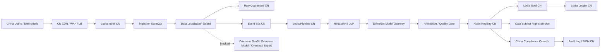
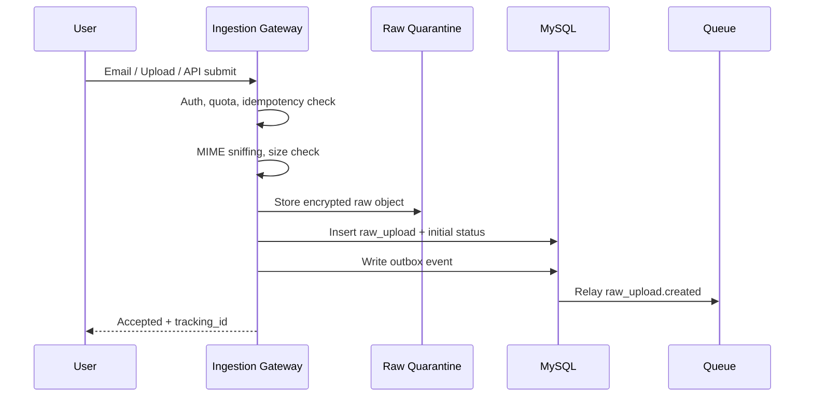
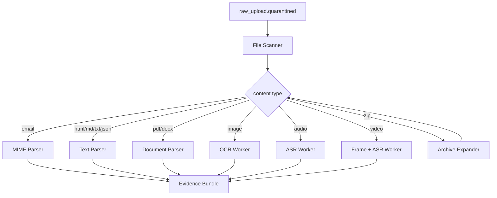
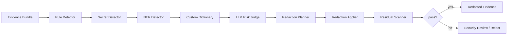
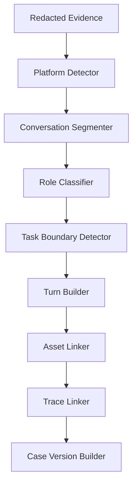
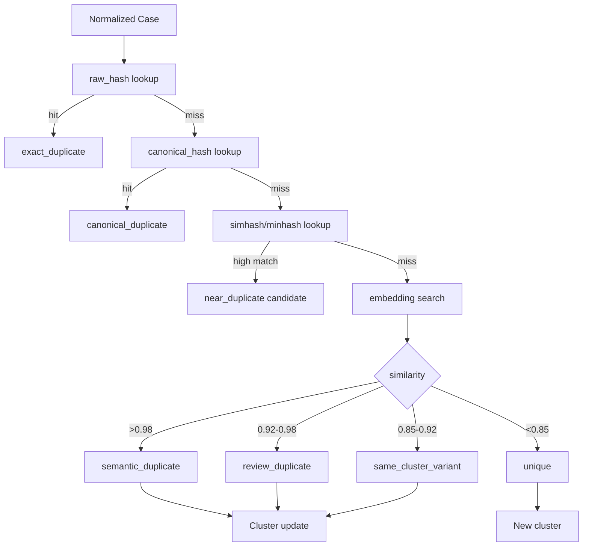
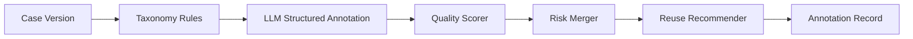
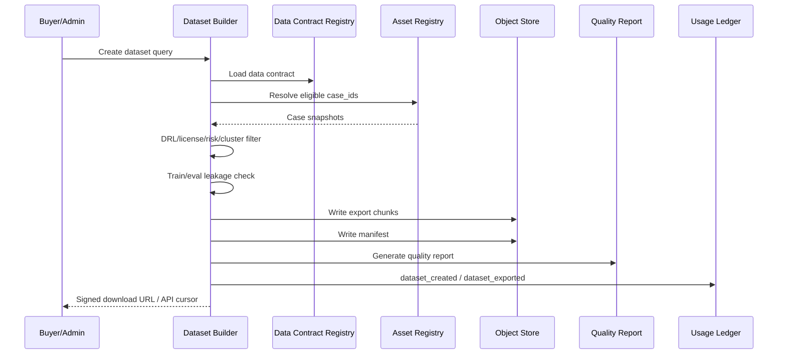

# Lodia 高性能技术架构与处理流程设计

版本：v0.5
日期：2026-05-07
关联文档：[LODIA_PRD.md](./LODIA_PRD.md)
架构定位：中国区独立运营的 LLM 长程任务数据资产处理平台
推荐路线：MVP 使用模块化单体 + 异步 worker，规模化后按瓶颈拆分服务

## 0. 品牌与技术模块命名

Lodia 是主品牌，不再把产品定义为单一邮箱系统。当前技术架构只围绕 `llm_long_horizon_task` 数据焦点迭代。Inbox 作为低摩擦入口模块，Pipeline、Gold、Ledger、Eval 分别承载长程任务处理、优质数据集、收益账本和评测能力。

| 产品模块 | 技术含义 |
| --- | --- |
| Lodia Inbox | LLM 对话、Agent trace、Codex/Cursor 任务、插件、API 等多入口采集层 |
| Lodia Pipeline | 解析、脱敏、去重、长程任务证据评分、标注、质量门禁和 DRL 分级处理链 |
| Lodia Gold | DRL4/DRL5 高质量长程任务训练数据集和 gold eval 数据集 |
| Lodia Ledger | CaseID、授权、UsageEvent、PayoutEvent 和审计账本 |
| Lodia Eval | 长程任务数据集评测、模型评测、Agent 任务评测和持续质量回流 |

中国区 v0.4 增加独立运营约束：

- 中国区与海外区物理、账号、网络、数据、日志、模型和运营后台完全隔离。
- 中国区所有用户数据、原始数据、脱敏数据、向量、日志、备份、模型调用和数据集交付默认留存在中国大陆。
- 中国区不使用境外 SaaS 处理用户数据，不调用境外模型 API，不向海外客户导出中国区数据。
- 中国区合规控制作为技术架构的一等能力，由策略引擎、出境阻断、授权快照、审计日志和供应商白名单共同执行。

## 1. 设计目标

Lodia 的核心不是邮件系统，而是高吞吐、可审计、隐私优先的 LLM 长程任务数据资产处理系统。技术架构需要同时满足四类需求：

- 高吞吐采集：支持邮件、插件、API、MCP、Agent trace 等多入口持续写入。
- 异步处理：对解析、脱敏、长程任务标注、embedding、聚类和数据集导出等重任务异步化。
- 数据治理：原始数据隔离，脱敏后进入业务链路，所有 Case 可追踪、可撤回、可审计。
- 数据质量：自动标注只作为预标注，必须通过 `llm_long_horizon_gate`、Quality Gate、DRL、Data Contract 和 Quality Report 才能进入商业交付。
- 数据变现：通过 CaseID、Dataset Manifest、Usage Ledger 和 Payout Ledger 支撑收益分配。

## 2. 非功能目标

### 2.1 MVP 目标

| 指标 | 目标 |
| --- | --- |
| 文本 Case 接收峰值 | 10,000 cases/day |
| 附件处理峰值 | 50,000 assets/day |
| 邮件接收成功率 | > 99% |
| 文本 Case 解析延迟 | P95 < 2 分钟 |
| 脱敏完成延迟 | P95 < 5 分钟 |
| 自动标注完成延迟 | P95 < 10 分钟 |
| Quality Gate 完成延迟 | P95 < 15 分钟 |
| DRL3+ 商用候选可追溯率 | 100% |
| Data Contract / Quality Report 生成率 | 100% |
| 原始数据 TTL 删除准确率 | 100% |
| UsageEvent 记录丢失率 | 0 |

### 2.2 Scale 目标

| 指标 | 目标 |
| --- | --- |
| 文本 Case 接收峰值 | 1,000,000 cases/day |
| 附件处理峰值 | 5,000,000 assets/day |
| API 写入峰值 | 2,000 req/s |
| 数据集导出 | 支持百万级 Case 流式导出 |
| 商用数据出厂检查 | 支持按 Data Contract 批量准入校验 |
| 训练/eval 泄漏检查 | 支持 cluster 级别 overlap 检查 |
| 多租户隔离 | 租户级权限、存储、索引和审计隔离 |
| 区域隔离 | 中国区单独部署；如未来存在海外区，必须另建环境且不共享数据 |

### 2.3 中国区 1 万 DAU 基准配置

中国区 MVP 先按 1 万日活用户稳定使用设计。该规模下，Web/API 压力不大，资源瓶颈主要在文件解析、OCR、脱敏、embedding、自动标注、去重聚类和数据集导出。

| 模块 | MVP 推荐配置 | 说明 |
| --- | --- | --- |
| 负载均衡/WAF/CDN | 云 LB + WAF + DDoS 防护 | 中国大陆节点，HTTPS，全站安全策略 |
| Web/API | 3 台，单台 4 vCPU / 8-16GB RAM | 无状态部署，支持横向扩容 |
| Ingestion/Parse Worker | 3 台，单台 8 vCPU / 16-32GB RAM | 邮件、上传、PDF、HTML、Markdown 解析 |
| Redaction/Annotation Worker | 3-5 台，单台 8 vCPU / 32GB RAM | 脱敏、标签、质量分、DRL |
| GPU Worker | 0-2 台，A10/L20 或同级 24GB+ VRAM | 自部署 OCR/ASR/embedding/小模型时启用 |
| 主数据库 | 托管 PostgreSQL，8 vCPU / 32GB RAM / 1-2TB SSD | 主备高可用、PITR、分区表 |
| Redis | 高可用版，2-4 vCPU / 8-16GB RAM | session、限流、短期缓存 |
| 消息队列 | 托管 RocketMQ/Kafka/RabbitMQ | 解析、脱敏、标注、导出异步化 |
| 对象存储 | OSS/COS/OBS，2-5TB 起步 | KMS 加密、生命周期、冷热分层 |
| 搜索/向量 | OpenSearch + Milvus/Qdrant，3 节点起步 | 脱敏文本索引和相似 Case 检索 |
| 日志审计 | 云日志 + 安全审计 | 网络运行日志、安全日志和管理员日志至少 6 个月 |
| 安全基础设施 | KMS、Secret Manager、堡垒机、VPN、MFA、SIEM | 等保二级基线，三级预留 |

容量扩展原则：

- API 服务按 CPU 和 RPS 横向扩容。
- Worker 按队列积压、P95 延迟和成本分层扩容。
- OCR/ASR/LLM 任务独立队列，避免阻塞文本 Case。
- 数据库优先做连接池、分区表、读副本和归档，再考虑拆库。
- 向量检索和全文搜索不与主库混跑。

## 3. 总体架构

```mermaid
flowchart LR
  A["Email Inbound"] --> G["Ingestion Gateway"]
  B["Web Upload"] --> G
  C["Browser Plugin"] --> G
  D["API / SDK"] --> G
  E["MCP Tools"] --> G

  G --> Q["Raw Quarantine Store"]
  G --> O["Outbox Events"]

  O --> MQ["Event Bus / Queue"]

  MQ --> P1["Parse Workers"]
  P1 --> P2["Extraction Workers"]
  P2 --> R1["Redaction Engine"]
  R1 --> R2["Residual Risk Scanner"]
  R2 --> N["Case Normalizer"]
  N --> D1["Dedup Engine"]
  D1 --> C1["Cluster Engine"]
  C1 --> A1["Annotation Engine"]
  A1 --> QG["Quality Gate / DRL Assigner"]
  QG --> H["Human / Expert Review"]
  H --> AR["Asset Registry"]

  AR --> DB["MySQL"]
  AR --> OBJ["Redacted Object Store"]
  AR --> VEC["Vector Index"]
  AR --> SRCH["Search Index"]

  AR --> DC["Data Contract Registry"]
  DC --> DS["Dataset Builder"]
  DS --> QR["Quality Report Generator"]
  QR --> EXP["Export / API / Marketplace"]
  EXP --> UL["Usage Ledger"]
  UL --> RC["Reconciliation"]
  RC --> PL["Payout Ledger"]
```



### 3.1 中国区独立部署架构



中国区网络出口默认拒绝，只有供应商白名单、备案域名、对象存储内网地址和国内模型服务端点可以访问。所有白名单变更必须经安全和合规审批。

### 3.2 控制平面与数据平面

Lodia 应拆成两条逻辑平面：

| 平面 | 职责 | 典型服务 |
| --- | --- | --- |
| 控制平面 | 用户、租户、权限、数据集、审核、账单、配置 | Web App、Admin API、Auth、Billing |
| 数据平面 | 上传、隔离、解析、脱敏、标注、去重、导出 | Ingestion、Workers、Asset Registry、Dataset Builder |

控制平面走低延迟请求响应。数据平面走事件驱动和异步 worker，避免长任务阻塞用户请求。

## 4. 推荐部署形态

### 4.1 MVP 部署

MVP 使用 Go 模块化单体 + 异步 Worker：

- Web/API：Go `net/http` 单二进制服务
- Worker：Go Worker
- Queue：Redis 分发，MySQL `jobs` 表作为状态源
- DB：MySQL 8.x
- Object Store：阿里云 OSS，开发环境可用本地对象目录
- Search：MySQL FULLTEXT 起步，后续接 OpenSearch / Vector DB
- Workflow：先用状态机 + outbox，后续接 Temporal

中国区 MVP 推荐部署：

- 云厂商：阿里云、腾讯云、华为云、火山引擎或同等中国大陆合规云区域。
- 区域：单一区域双可用区起步，例如华北、华东或华南；同城高可用优先，异地灾备进入 Phase 2。
- 网络：生产 VPC 独立，划分 public、app、worker、data、quarantine、security 子网。
- 访问：公网只暴露 WAF/LB；数据库、队列、对象存储、KMS、日志使用内网访问。
- 运维：VPN/零信任网关 + 堡垒机 + MFA + 审批 + 全量审计。
- 模型：默认国内模型服务或私有化模型，禁止直连境外模型 API。
- 日志：云日志、审计日志、WAF 日志、VPC Flow Log 全部存储在中国大陆。
- 备份：数据库 PITR、对象存储版本控制、备份桶和快照都在中国大陆。

优点：

- 开发快
- 运维成本低
- 事务边界简单
- 适合验证产品闭环

限制：

- 跨 worker 流程编排需要自建状态管理
- 高峰下 Redis/RabbitMQ 需要谨慎调优
- 复杂重试和补偿逻辑会逐步变重

### 4.2 规模化部署

商业化后升级为事件驱动架构：

- Kubernetes 部署服务和 worker
- Kafka 或 Pulsar 作为事件总线
- Temporal 作为长流程编排
- MySQL 分区/分库分表 + 读写分离
- 向量检索升级为 Qdrant/Milvus/Weaviate 可选
- OpenSearch 负责全文检索
- GPU worker pool 处理 OCR、ASR、视频抽帧和视觉模型
- 多区域对象存储和 KMS

中国区规模化时，需要额外拆分：

- China Compliance Policy Engine
- Data Localization Guard
- Consent & Authorization Service
- Data Subject Rights Service
- Vendor Processing Registry
- Content Safety Service
- Important Data Candidate Scanner
- Domestic Model Gateway
- Cross-border Egress Firewall
- MLPS/SOC Operations Console

## 5. 核心服务划分

| 服务 | 职责 | 是否 MVP 必需 |
| --- | --- | --- |
| Ingestion Gateway | 邮件、上传、API、MCP 统一入口 | 是 |
| Raw Quarantine Service | 原始数据隔离、加密、TTL、审计 | 是 |
| File Scanner | MIME 校验、病毒扫描、压缩包防护 | 是 |
| Parse Service | MIME、HTML、Markdown、JSON、PDF 基础解析 | 是 |
| Multimodal Extraction Service | OCR、ASR、视频抽帧、表格提取 | 部分 |
| Redaction Engine | PII、密钥、商密识别与脱敏 | 是 |
| Residual Risk Scanner | 脱敏后二次残留扫描 | 是 |
| Case Normalizer | 统一 Case、Turn、Asset、Trace schema | 是 |
| Dedup Service | raw_hash、canonical_hash、simhash 去重 | 是 |
| Cluster Service | embedding 相似聚类、新颖度计算 | 是 |
| Annotation Service | 自动标签、质量分、用途建议 | 是 |
| Quality Gate Service | schema、隐私、授权、正确性、可用性和数据集准入门禁 | 是 |
| DRL Assigner | 根据门禁结果分配 Data Readiness Level | 是 |
| Review Service | 审核队列、人审工作台 | 是 |
| Expert Review Service | 高风险行业、训练集、gold eval 的专家审核 | Phase 2 |
| Asset Registry | Case 状态机、版本、资产账本 | 是 |
| Data Contract Registry | 数据集字段、授权、用途、质量阈值和最低 DRL 规则 | 是 |
| Dataset Builder | 数据集筛选、manifest、导出 | 是 |
| Quality Report Generator | 数据集分布、DRL、去重、人审、授权和限制披露 | 是 |
| Usage Ledger | 使用事件账本 | 是 |
| Reconciliation Service | 导出、订单、UsageEvent、PayoutEvent 对账 | Phase 2 |
| Payout Engine | 分账计算和结算 | Phase 2 |
| Evaluation Harness | 标注、脱敏、去重和数据集质量回归评测 | Phase 2 |
| Source Trust Service | 贡献者、平台来源和企业空间可信度评分 | Phase 2 |
| Model Gateway | 多模型路由、限流、成本控制 | 是 |
| Audit Service | 安全审计和合规查询 | 是 |

中国区新增服务：

| 服务 | 职责 | MVP 必需 |
| --- | --- | --- |
| China Compliance Policy Engine | 根据 PIPL、DSL、网络安全法、网络数据安全条例、数据出境规则执行策略 | 是 |
| Consent & Authorization Service | 管理告知同意、单独同意、授权范围、协议版本和撤回 | 是 |
| Data Subject Rights Service | 处理查阅、复制、更正、删除、撤回、注销等请求 | 是 |
| Data Localization Guard | 检查存储区域、网络出口、供应商端点和导出目的地 | 是 |
| Vendor Processing Registry | 记录受托处理方、数据类型、处理目的、合同和审计状态 | 是 |
| Content Safety Service | 内容安全分类、违法违规内容阻断、生成内容标识触发 | 是 |
| Important Data Candidate Scanner | 识别重要数据候选、大规模聚合风险和行业高敏数据 | Phase 1 |
| Domestic Model Gateway | 统一管理国内模型供应商、私有模型、调用审计和内容脱敏 | 是 |
| ICP/MLPS Compliance Console | 管理备案、等保、测评、整改、日志留存和合规报表 | Phase 1 |

## 6. 端到端处理流程

### 6.1 Ingestion 接入流程



关键实现：

- 每次提交生成 `submission_id` 和 `idempotency_key`。
- 邮件入口使用 `message_id + recipient_inbox + raw_hash` 做幂等。
- 上传入口使用预签名 URL，大文件不经过 API 服务内存。
- API 入口要求传 `Idempotency-Key`。
- 所有入口只做轻量校验和落盘，不做重处理。
- 成功接收后立即返回 `202 Accepted`。

中国区接入额外检查：

1. 校验请求来源、用户归属区域和租户区域必须为 `CN`。
2. 校验上传入口、邮件入口、API endpoint、对象存储 bucket 均为中国区资源。
3. 记录个人信息处理规则版本、贡献者授权协议版本和 `consent_snapshot_id`。
4. 对企业租户校验企业数据处理协议、员工授权模式和默认用途。
5. 对公网提交内容执行内容安全初筛，高风险内容进入隔离而不进入后续标注。

### 6.2 原始隔离流程

Raw Quarantine 是系统的风险缓冲层。

处理步骤：

1. 将原始文件写入独立对象存储桶。
2. 使用 KMS envelope encryption 加密。
3. 写入 `raw_uploads` 表，状态为 `quarantined`。
4. 生成 `raw_hash`、`content_length`、`mime_detected`。
5. 扫描文件类型、压缩包深度、文件数量和恶意内容。
6. 命中高危规则时进入 `rejected_high_risk`，触发删除任务。
7. 正常样本进入解析队列。

中国区 Quarantine 要求：

- Raw Quarantine 只能部署在中国大陆对象存储和数据库。
- Raw object 禁止被模型网关、人工审核台、搜索索引和导出服务直接读取。
- Raw object metadata 必须包含 `jurisdiction=CN`、`source_region`、`retention_policy_id`、`data_classification_pending=true`。
- 所有原始数据读取必须写入高敏审计日志。
- TTL 删除日志需要可证明，包括对象 key、版本、删除时间、执行任务和校验结果。

存储原则：

- Quarantine bucket 不对普通服务开放读权限。
- 只有指定 worker role 可以读取。
- 原文路径不进入日志。
- 原文不进入全文索引、向量库、标注服务或人审 UI。
- 每个原文对象必须有 `delete_after`。

### 6.3 解析和抽取流程



输出统一为 `EvidenceBundle`：

```json
{
  "submission_id": "sub_123",
  "raw_upload_id": "raw_123",
  "segments": [
    {
      "segment_id": "seg_1",
      "type": "text",
      "source_asset_id": "asset_raw_1",
      "content": "extracted text",
      "page": 1,
      "bbox": null,
      "confidence": 0.98
    }
  ],
  "assets": [
    {
      "asset_id": "asset_raw_1",
      "type": "pdf",
      "raw_hash": "sha256...",
      "mime": "application/pdf"
    }
  ],
  "metadata": {
    "detected_platform": "ChatGPT",
    "language": "zh-CN"
  }
}
```

性能策略：

- 文本解析 CPU worker 横向扩展。
- OCR、ASR、视频抽帧进入专用 worker pool。
- 大 PDF 按页并行抽取。
- 长音频按时间片切分并发 ASR。
- 视频默认只处理关键帧和音轨，MVP 不做全帧理解。
- 所有多模态任务设置最大页数、最大时长、最大像素和最大压缩比。

### 6.4 自动脱敏流程

脱敏引擎采用多阶段 pipeline：



#### 6.4.1 检测器

| 检测器 | 输入 | 输出 |
| --- | --- | --- |
| Rule Detector | 文本、OCR、ASR | 手机号、邮箱、身份证、银行卡、URL、IP |
| Secret Detector | 文本、代码、日志 | API key、JWT、Cookie、连接串、密码 |
| NER Detector | 文本 | 人名、公司、地点、学校、医院、职位 |
| Custom Dictionary | 文本 | 企业员工、客户、项目代号、产品代号 |
| LLM Risk Judge | 低置信片段 | 上下文隐私、商密、重识别风险 |
| Visual Detector | 图片/PDF 坐标 | 截图中的隐私区域 bounding box |

#### 6.4.2 脱敏动作

脱敏输出必须保留业务语义：

| 类型 | 动作 | 示例 |
| --- | --- | --- |
| 密钥 | 删除 | `sk-xxx` -> `[SECRET_REMOVED]` |
| 姓名 | 稳定替换 | `张三` -> `[PERSON_1]` |
| 公司 | 稳定替换 | `某某科技` -> `[ORG_1]` |
| 手机 | 替换 | `138...` -> `[PHONE_1]` |
| 金额 | 区间化 | `327856 元` -> `[AMOUNT_RANGE_100K_500K]` |
| 地址 | 降精度 | `上海市徐汇区某路 88 号` -> `[ADDRESS_CITY_LEVEL]` |
| 时间 | 泛化 | `2026-05-05 10:23` -> `[DATE_RECENT]` |
| 图片区域 | 打码 | bounding box blur / mask |

#### 6.4.3 Mapping Vault

对公开和平台数据市场：

- 不保存可逆映射。
- `redaction_events` 只保存原文 hash、类型、位置和替换 token。

对企业私有版：

- 可选 Mapping Vault。
- 映射由企业自管密钥加密。
- Lodia 平台默认无权解密。

#### 6.4.4 二次残留扫描

脱敏后再次扫描：

- 规则扫描
- Secret 扫描
- NER 扫描
- 图片 OCR 后再扫
- LLM 判断是否仍可重识别

输出：

```json
{
  "privacy_risk_score": 0.08,
  "business_secret_risk_score": 0.12,
  "residual_findings": [],
  "redaction_status": "passed"
}
```

高风险处理：

- `privacy_risk_score >= 0.8`：拒收或仅私有库。
- `0.4 <= privacy_risk_score < 0.8`：进入安全复核。
- `< 0.4`：继续标准化。

中国区脱敏额外规则：

- 先用本地规则、词典、DLP 和小模型完成第一轮识别，原始文本不得直接发送给外部模型。
- 识别身份证号、手机号、银行卡、地址、医疗、行踪、未成年人、合同、客户名单、密钥、源代码凭据等中国区高敏字段。
- 对 CN-D3 数据默认拒收或仅保留企业私有用途，不进入平台候选数据集。
- 对 CN-D4 重要数据候选默认阻断商业化出库，并进入合规复核。
- 脱敏后的文本才允许进入 Domestic Model Gateway 做标注、摘要和质量判断。

### 6.5 Case 标准化流程

Case Normalizer 将脱敏后的 evidence 转成资产 schema：



关键细节：

- 对话分轮次：识别 user、assistant、system、tool、reviewer。
- 多任务拆分：一封邮件里可能包含多个 Case，按任务边界切分。
- 附件绑定：将截图、PDF、代码、日志挂到具体 turn 或 case。
- Trace 绑定：将工具调用、终端输出、浏览器操作绑定到 task step。
- 版本化：同一个 Case 的更新提交生成新 `case_version`。

### 6.6 去重和聚类流程

去重必须分层执行，越便宜的检测越靠前。



#### 6.6.1 canonical_hash 生成

规范化规则：

- 去除邮件 header/footer。
- 去除时间戳、签名、追踪链接和转发链。
- 统一 Markdown、HTML text、空格和标点。
- 只保留核心 turns、tool calls、final outcome。
- 附件用 `asset_hash + asset_summary` 表示。

#### 6.6.2 embedding 策略

为每条 Case 生成多组 embedding：

- `problem_embedding`：用户问题和目标
- `answer_embedding`：AI 回答
- `task_embedding`：任务摘要
- `trace_embedding`：Agent 执行步骤摘要
- `asset_embedding`：附件摘要

检索时按租户和数据等级过滤：

```text
tenant_id = current_tenant
data_level in allowed_levels
license_status != revoked
deleted_at is null
```

#### 6.6.3 聚类更新

Cluster Service 维护：

- `cluster_id`
- `canonical_case_id`
- `frequency_count`
- `variant_count`
- `first_seen_at`
- `last_seen_at`
- `best_case_id`
- `failure_case_ids`
- `contributors`
- `cluster_quality_score`

重复不删除，只改变收益和数据集候选权重。

### 6.7 自动标注流程

Annotation Service 由规则、模型和评分器组成。



#### 6.7.1 标注输出

```json
{
  "domain": "software_engineering",
  "task_type": "code_debugging",
  "difficulty": "medium",
  "quality_level": "usable",
  "reuse_types": ["eval", "case_library"],
  "has_tool_trace": true,
  "has_user_feedback": false,
  "quality_score": 0.78,
  "novelty_score": 0.64,
  "commercial_readiness": "review_required",
  "confidence": 0.86
}
```

#### 6.7.2 模型网关

Model Gateway 负责：

- 不同模型路由
- prompt 模板版本管理
- JSON schema 校验
- 成本预算
- 限流
- 失败回退
- 输出缓存
- prompt injection 防护

原则：

- 用户提交内容永远作为 data，不作为 instruction。
- 标注 prompt 与用户内容严格分隔。
- 模型输出必须通过 JSON schema validation。
- 低置信输出进入人审，不自动进入 gold set。

### 6.8 Quality Gate 与 DRL 分配流程

Quality Gate 是商业化数据出厂前的核心门禁。它不重新做全部标注，而是汇总前序证据，决定 Case 可进入哪个数据等级。


#### 6.8.1 Gate 输入

Quality Gate 读取：

- Case schema 完整度。
- redaction status 和 residual scan 结果。
- license status 和 allowed uses。
- duplicate status、cluster_id 和 novelty_score。
- annotation confidence。
- answer_correctness_confidence。
- redaction_utility_score。
- source_trust_score。
- asset_extraction_confidence。
- human/expert review status。

#### 6.8.2 Gate 输出

```json
{
  "case_id": "case_123",
  "data_readiness_level": "DRL2",
  "gate_results": {
    "schema_gate": "passed",
    "privacy_gate": "passed",
    "license_gate": "limited",
    "dedup_gate": "passed",
    "correctness_gate": "unverified",
    "utility_gate": "passed"
  },
  "allowed_uses": ["private_library", "candidate_pool"],
  "blocked_uses": ["commercial_dataset", "training", "gold_eval"],
  "required_actions": ["human_review", "answer_verification"]
}
```

#### 6.8.3 DRL 分配规则

| DRL | 技术条件 |
| --- | --- |
| DRL0 | 原始或高风险隔离数据 |
| DRL1 | 脱敏通过，但未完成自动标注或授权不完整 |
| DRL2 | 自动标注通过，schema/privacy/license 基础门禁通过 |
| DRL3 | 人审通过，商用授权明确，数据集准入通过 |
| DRL4 | 专家验证或证据验证，训练用途授权明确 |
| DRL5 | 双人审核、评分标准、答案依据和泄漏隔离全部通过 |

硬性约束：

- 自动 worker 不得直接写入 DRL3 及以上。
- DRL3+ 必须有 review record。
- DRL4+ 必须有 expert review 或 verifiable evidence。
- DRL5 必须有 double review、rubric 和 holdout isolation。

中国区 Quality Gate 增加：

- `cn_data_classification_gate`：检查 CN-D0 到 CN-D4 数据等级。
- `consent_scope_gate`：检查授权范围是否覆盖商业、训练、评测或企业内部用途。
- `cross_border_gate`：检查导出目的地、客户区域、供应商区域和网络路径。
- `important_data_gate`：检查重要数据候选是否完成合规复核。
- `content_safety_gate`：检查内容安全和生成合成内容标识触发条件。
- `vendor_policy_gate`：检查是否调用了未备案或未授权受托处理方。

### 6.9 人工审核流程

Review Service 根据风险和价值路由：

| 队列 | 进入条件 |
| --- | --- |
| privacy_review | 残留风险中高 |
| duplicate_review | 相似度 0.92-0.98 |
| quality_review | 高价值但低置信 |
| license_review | 授权不完整 |
| gold_review | 候选 gold sample |
| rejection_review | 自动拒收申诉 |

审核工作台要求：

- 只展示脱敏内容。
- 展示脱敏字段类型，不展示原文。
- 展示聚类上下文和相似 Case。
- 所有操作写入 `reviews` 和 `audit_logs`。
- 审核动作必须带版本号，避免覆盖并发修改。

### 6.10 数据资产注册流程

Asset Registry 是 Case 的可信状态源。

职责：

- 生成 CaseID。
- 管理 Case 状态机。
- 管理 Case 版本。
- 维护授权、删除、撤回状态。
- 记录 Case 与 Asset、Trace、Annotation、Review 的关系。
- 对外提供只读查询 API。

状态流：

```text
uploaded
quarantined
parsed
redacted
residual_scanned
normalized
deduplicated
clustered
annotated
review_pending
approved_private
approved_commercial
dataset_ready
monetizable
revoked
deleted
```

实现要求：

- 状态变更使用乐观锁。
- 关键状态变更写 `case_state_events`。
- 业务表可更新，账本表只追加。
- 删除使用软删除 + 异步物理清理。

### 6.11 数据集生成流程

Dataset Builder 负责从 Case 生成可交付数据资产。



数据集必须使用快照：

- 导出时固定 Case 版本。
- 后续 Case 更新不改变历史交付。
- 撤回授权后，新导出不再包含该 Case。
- 已交付数据按授权协议处理，不做技术上不可证明的删除承诺。

高性能导出：

- 使用 cursor 分页和流式写入。
- 大数据集分 chunk，例如 10,000 Case 一个文件。
- 生成 `contract.json`、`manifest.json`、`quality_report.json`、`data-0001.jsonl`、`data-0002.jsonl`。
- 每个 chunk 生成 hash。
- 导出任务异步运行。

出库前强制检查：

- Case 最低 DRL 是否满足 Data Contract。
- 是否含撤回、过期、授权不匹配的 Case。
- 同一 cluster 占比是否超阈值。
- train/eval/RAG/case library 是否发生泄漏。
- 是否满足买方用途，例如训练、评测、RAG、案例展示。
- Quality Report 是否生成成功。

中国区数据集生成前必须执行：

- 买方区域必须为中国区，海外客户默认无法选择中国区 Case。
- Data Contract 必须包含中国区授权范围、禁止出境条款、禁止再分发条款、撤回处理条款和安全保护义务。
- Dataset Manifest 必须包含 Case 的 `jurisdiction`、`cn_data_classification`、授权快照、数据等级、重要数据候选结果和合规门禁结果。
- 导出对象只能写入中国大陆对象存储。
- 导出 URL 必须短期有效、强鉴权、可撤销、可审计。
- 导出完成后写入 UsageEvent，并触发后续对账和贡献者收益计算。

### 6.12 使用账本和分账流程

Usage Ledger 是分账可信基础。

原则：

- 所有可计费使用都写 UsageEvent。
- UsageEvent append-only。
- 使用方、数据集、Case、授权版本必须齐全。
- 事件必须可幂等。

UsageEvent 示例：

```json
{
  "usage_event_id": "use_123",
  "event_type": "dataset_exported",
  "case_id": "case_001",
  "dataset_id": "ds_123",
  "buyer_id": "buyer_456",
  "license_version": "lic_v2",
  "manifest_version": "manifest_v1",
  "billable": true,
  "payout_eligible": true,
  "occurred_at": "2026-05-05T10:00:00Z"
}
```

分账计算：

1. 按账期读取 billable UsageEvent。
2. 计算数据包收入或 API 收入。
3. 计算贡献者池金额。
4. 按 Case 权重分配：
   - quality_score
   - novelty_score
   - usage_count
   - license_weight
   - duplicate_penalty
5. 生成 PayoutEvent。
6. 等待结算和风控确认。

对账规则：

- `export_job.completed` 必须与 `dataset_exported` UsageEvent 一一对应。
- 导出对象的 `manifest_hash` 必须写入 UsageEvent。
- UsageEvent 与订单、发票、PayoutEvent 按账期对账。
- 对账不一致时冻结相关分账，进入人工复核。
- 重放 UsageEvent 不得重复生成 PayoutEvent。

## 7. 数据存储设计

### 7.1 存储分层

| 层 | 技术 | 内容 |
| --- | --- | --- |
| Raw Quarantine | Object Store + KMS | 原始邮件、附件、上传文件 |
| Redacted Store | Object Store + KMS | 脱敏附件、导出文件、manifest |
| Metadata DB | MySQL | 用户、Case、状态、审核、账本 |
| Vector Index | OpenSearch / Vector DB / Qdrant | Case embedding 和聚类检索 |
| Search Index | MySQL FULLTEXT 或 OpenSearch | 脱敏 Case 全文检索 |
| Cache | Redis | 队列、限流、短期任务状态 |
| Audit Log | MySQL append-only 或对象存储 | 审计和合规事件 |
| Quality Store | MySQL + Object Store | gate 结果、质量报告、data contract |

中国区存储约束：

- 所有存储产品必须选择中国大陆地域。
- 禁止使用 BigQuery、Snowflake 海外区、境外日志分析、境外错误追踪等服务处理中国区数据。
- 备份、快照、归档、冷存储和灾备副本也必须留存在中国大陆。
- KMS 主密钥和密钥材料必须在中国大陆地域。
- Analytics 层只能使用脱敏聚合数据，不存可重识别明细。

### 7.2 MySQL 表设计要点

#### raw_uploads

关键字段：

- `raw_upload_id`
- `tenant_id`
- `contributor_id`
- `submission_id`
- `raw_uri`
- `raw_hash`
- `mime_detected`
- `size_bytes`
- `risk_status`
- `delete_after`
- `deleted_at`
- `created_at`

索引：

- unique `(tenant_id, raw_hash)`
- index `(delete_after) where deleted_at is null`
- index `(submission_id)`

#### cases

关键字段：

- `case_id`
- `tenant_id`
- `contributor_id`
- `current_version_id`
- `status`
- `data_level`
- `data_readiness_level`
- `domain`
- `task_type`
- `language`
- `quality_score`
- `schema_completeness_score`
- `redaction_utility_score`
- `answer_correctness_confidence`
- `training_readiness_score`
- `eval_readiness_score`
- `commercial_readiness_score`
- `privacy_risk_score`
- `duplicate_status`
- `cluster_id`
- `license_status`
- `commercial_use_allowed`
- `jurisdiction`
- `source_region`
- `cn_data_classification`
- `important_data_candidate`
- `sensitive_personal_info_detected`
- `consent_snapshot_id`
- `commercial_authorization_scope`
- `cross_border_blocked`
- `retention_policy_id`
- `deleted_at`

索引：

- index `(tenant_id, status, created_at)`
- index `(tenant_id, domain, task_type)`
- index `(tenant_id, quality_score desc)`
- index `(tenant_id, data_readiness_level, status)`
- index `(cluster_id)`
- partial index `(tenant_id, commercial_use_allowed) where deleted_at is null`

#### quality_gate_results

字段：

- `quality_gate_result_id`
- `case_id`
- `case_version_id`
- `gate_name`
- `status`
- `score`
- `reason_codes`
- `required_actions`
- `model_or_rule_version`
- `created_at`

索引：

- index `(case_id, created_at desc)`
- index `(gate_name, status)`
- index `(case_version_id)`

#### data_contracts

字段：

- `data_contract_id`
- `dataset_id`
- `minimum_drl`
- `allowed_uses`
- `excluded_uses`
- `required_fields`
- `quality_thresholds`
- `license_terms`
- `version`
- `status`
- `created_at`

索引：

- index `(dataset_id, version)`
- index `(status)`

#### quality_reports

字段：

- `quality_report_id`
- `dataset_id`
- `manifest_version`
- `report_uri`
- `drl_distribution`
- `cluster_count`
- `duplicate_rate`
- `reviewed_ratio`
- `expert_verified_ratio`
- `privacy_summary`
- `known_limitations`
- `created_at`

索引：

- index `(dataset_id, manifest_version)`

#### dataset_split_ledger

字段：

- `split_event_id`
- `case_id`
- `cluster_id`
- `dataset_id`
- `split_type`
- `manifest_version`
- `created_at`

用途：

- 防止训练集、评测集、RAG 和公开示例之间发生 Case 级和 cluster 级泄漏。

#### 中国区合规表

新增或扩展：

- `consent_snapshots`：记录告知同意、单独同意、授权范围、协议版本和撤回。
- `data_subject_requests`：记录查阅、复制、更正、删除、限制处理、撤回和注销请求。
- `cn_data_classifications`：记录 CN-D0 到 CN-D4 分类分级证据。
- `compliance_reviews`：记录合规复核、重要数据候选复核和出境例外审批。
- `vendor_processing_records`：记录国内模型、OCR、ASR、短信、邮件、日志等受托处理方调用。
- `data_localization_policies`：记录数据地域、供应商 endpoint、导出目的地和阻断策略。
- `egress_policy_events`：记录所有出境阻断、放行和策略变更。
- `mlps_compliance_tasks`：记录等保定级、备案、测评、整改和复测任务。
- `content_safety_results`：记录内容安全检测和生成合成内容标识触发结果。
- `important_data_candidate_reviews`：记录重要数据候选识别、复核结论和禁止用途。

#### case_versions

每次标准化或审核变更生成版本。

字段：

- `case_version_id`
- `case_id`
- `canonical_hash`
- `content_hash`
- `summary`
- `redacted_content_uri`
- `created_by`
- `created_at`

索引：

- unique `(tenant_id, canonical_hash)`
- index `(case_id, created_at desc)`

#### case_embeddings

字段：

- `embedding_id`
- `case_id`
- `case_version_id`
- `embedding_type`
- `embedding`
- `model`
- `created_at`

索引：

- HNSW/IVFFlat index on `embedding`
- index `(tenant_id, embedding_type)`

#### usage_events

字段：

- `usage_event_id`
- `idempotency_key`
- `event_type`
- `tenant_id`
- `buyer_id`
- `dataset_id`
- `case_id`
- `manifest_version`
- `billable`
- `payout_eligible`
- `occurred_at`

索引：

- unique `(idempotency_key)`
- index `(case_id, occurred_at)`
- index `(dataset_id, occurred_at)`
- index `(buyer_id, occurred_at)`
- monthly partition by `occurred_at`

### 7.3 分区策略

高增长表需要分区：

| 表 | 分区方式 |
| --- | --- |
| raw_uploads | 按 `created_at` 月分区 |
| case_state_events | 按 `created_at` 月分区 |
| usage_events | 按 `occurred_at` 月分区 |
| audit_logs | 按 `created_at` 月分区 |
| redaction_events | 按 `created_at` 月分区 |

大租户可升级为 tenant-level shard。

## 8. 事件和队列设计

### 8.1 事件主题

| Topic | 说明 |
| --- | --- |
| `raw_upload.created` | 原始上传已进入隔离区 |
| `raw_upload.scanned` | 文件安全扫描完成 |
| `evidence.extracted` | 文本和多模态证据抽取完成 |
| `evidence.redacted` | 脱敏完成 |
| `evidence.residual_scanned` | 二次扫描完成 |
| `case.normalized` | Case 标准化完成 |
| `case.deduplicated` | 去重完成 |
| `case.clustered` | 聚类完成 |
| `case.annotated` | 自动标注完成 |
| `case.quality_gated` | 质量门禁完成 |
| `case.drl_assigned` | 数据可用等级已分配 |
| `case.reviewed` | 人审完成 |
| `case.expert_verified` | 专家验证完成 |
| `dataset.created` | 数据集创建 |
| `dataset.contract_checked` | 数据合同准入检查完成 |
| `dataset.quality_reported` | 质量报告生成完成 |
| `dataset.exported` | 数据集导出 |
| `usage.recorded` | 使用记录生成 |
| `usage.reconciled` | 使用事件对账完成 |
| `payout.calculated` | 分账计算完成 |

中国区新增事件：

| Topic | 说明 |
| --- | --- |
| `consent.captured` | 授权快照已生成 |
| `consent.withdrawn` | 用户撤回授权 |
| `data_subject_request.created` | 用户权利请求已创建 |
| `case.cn_classified` | 中国区数据分类分级完成 |
| `case.important_data_candidate` | 重要数据候选已识别 |
| `compliance.review_required` | 需要合规复核 |
| `egress.blocked` | 出境或非白名单出口被阻断 |
| `vendor.call.recorded` | 受托处理方或模型调用已记录 |
| `content_safety.flagged` | 内容安全命中 |
| `mlps.audit_event.recorded` | 等保审计事件已记录 |

### 8.2 Outbox Pattern

所有数据库状态变更和事件发布都用 outbox：

1. 在同一个事务中更新业务表和 `outbox_events`。
2. Outbox relay 将事件发布到队列。
3. 消费者使用 `idempotency_key` 保证重复消费安全。
4. 发布成功后标记 outbox event delivered。

这能避免“数据库写成功但事件丢失”的问题。

### 8.3 重试与死信

每个 worker 需要：

- 最大重试次数
- 指数退避
- 可区分 transient error 和 permanent error
- 死信队列
- 人工重放入口

推荐策略：

| 错误类型 | 策略 |
| --- | --- |
| 模型超时 | 重试 3 次，换模型 fallback |
| OCR 失败 | 重试 2 次，失败后标记 asset_unreadable |
| 文件损坏 | 不重试，进入 rejected_invalid_file |
| 脱敏残留高风险 | 不自动重试，进入安全复核 |
| DB 冲突 | 幂等处理后重试 |
| 队列积压 | 扩容 worker 或降级低优先任务 |

## 9. 性能优化策略

### 9.1 写入层

- 上传走预签名 URL。
- API 只做校验、落库、发事件。
- 邮件附件直接落对象存储。
- 大文件分片上传。
- 使用 idempotency 避免重复处理。
- 对租户和用户做速率限制。

### 9.2 Worker 层

- 按任务类型拆 worker pool。
- 文本任务高并发 CPU worker。
- OCR/ASR/视觉任务独立 GPU 或高 CPU worker。
- 标注和 embedding 支持批量请求。
- 低优先级任务可延迟处理。
- 高风险安全任务优先处理。
- Quality Gate 使用规则优先，LLM 只处理低置信和高价值样本。
- DRL3+ 升级任务单独队列，避免被普通自动标注任务挤压。

### 9.3 数据库层

- 高频写入表分区。
- 账本表 append-only。
- 读模型用 materialized view 或异步汇总表。
- 数据集查询使用预计算标签和评分，不实时跑模型。
- 商用出库使用 `data_readiness_level`、`data_contract_id` 和 `cluster_id` 预索引。
- 导出任务流式读取，避免一次加载全部 Case。

### 9.4 向量检索层

- 只对 Redacted Case 建 embedding。
- 按租户、数据等级和授权状态做 metadata filter。
- embedding 批量生成。
- 对大租户单独索引。
- 聚类可异步延迟，不阻塞 Case 入库。
- train/eval 泄漏检查优先使用 cluster_id 和 canonical_hash，embedding 近似检查作为补充。

### 9.5 成本控制

- 先规则和轻模型，后大模型。
- 对重复 Case 跳过昂贵标注。
- 对低价值 Case 降低多模态处理深度。
- 对 DRL0-DRL2 的低价值样本不做专家模型验证。
- 只有 DRL3+ 候选和付费数据集才生成完整 Quality Report。
- 对相同内容缓存 OCR、ASR、embedding 和 annotation。
- 使用模型网关做预算和调用审计。

### 9.6 中国区成本与供应商策略

- 优先使用国内云托管数据库、消息队列、对象存储、WAF、日志和 KMS，减少自运维成本。
- 国内模型调用必须经过 Domestic Model Gateway，支持供应商路由、预算控制、脱敏前置、缓存和批处理。
- 大模型标注前置规则筛选，低质量、重复、高风险、未授权 Case 不进入模型。
- OCR/ASR/GPU 任务按优先级和租户限额排队，避免成本尖峰。
- 企业专属租户可单独计费高成本模型、长文档和多模态处理。

## 10. 多模态处理细节

### 10.1 图片和截图

流程：

1. 检测图片类型、尺寸和 EXIF。
2. 删除 EXIF。
3. OCR 识别文字。
4. 检测文本 PII。
5. 检测 UI 中可能的头像、二维码、账号、手机号。
6. 对 bounding box 执行 mask。
7. 生成脱敏图片和 OCR 文本。

输出：

- redacted image
- OCR segments
- bounding box redaction events
- image summary

### 10.2 PDF 和文档

流程：

1. 文本层抽取。
2. 如果无文本层，逐页 OCR。
3. 表格抽取。
4. 页级 PII 检测。
5. 坐标级打码。
6. 生成 redacted PDF 或只保留脱敏文本。

MVP 建议：

- 默认不生成 redacted PDF，只生成脱敏文本和页级引用。
- 企业版再支持可视化 PDF 打码。

### 10.3 音频

流程：

1. 音频格式标准化。
2. ASR 转写。
3. 可选说话人分离。
4. 对转写文本脱敏。
5. 原始音频默认不进入数据市场。
6. 商业数据集中只使用脱敏 transcript。

### 10.4 视频和录屏

流程：

1. 抽取音轨 ASR。
2. 按场景变化抽关键帧。
3. 关键帧 OCR。
4. 检测账号、页面 URL、代码、客户信息。
5. 生成步骤摘要。
6. 原始视频默认不进入市场。

MVP 限制：

- 最大时长 5 分钟。
- 只处理关键帧和音轨。
- 高敏录屏进入人工复核。

### 10.5 Agent Trace

Agent trace 是 Lodia 的高价值数据。

建议标准格式：

```json
{
  "trace_id": "trace_123",
  "case_id": "case_123",
  "steps": [
    {
      "step_id": "step_1",
      "type": "tool_call",
      "tool_name": "browser.open",
      "input": {"url": "[URL_REDACTED]"},
      "output_summary": "opened target page",
      "status": "success",
      "duration_ms": 420
    }
  ],
  "final_status": "success",
  "failure_reason": null
}
```

处理要求：

- tool input/output 也必须脱敏。
- 命令行和日志必须先 secret scan。
- 浏览器 URL、DOM、截图必须做 PII 和商密检测。
- trace 可用于 Agent eval，不默认用于训练。

## 11. 数据质量生产线和商业数据出厂

### 11.1 数据产品出厂流水线

可商用和可训练数据必须通过出厂流水线：

```text
Case candidate
-> Quality Gate
-> DRL assignment
-> Review or expert verification
-> Dataset Contract Check
-> Cluster sampling
-> Distribution balancing
-> Train/eval leakage check
-> Manifest
-> Quality Report
-> Export
-> Usage Ledger
```

### 11.2 Data Contract Check

Data Contract Checker 在出库前执行：

- 最低 DRL 校验。
- 授权用途校验。
- 必填字段校验。
- schema 版本兼容性校验。
- 最大重复率校验。
- 最低人审比例校验。
- 隐私风险阈值校验。
- 禁止用途校验。

失败时导出任务不能进入 `completed`，且不能生成可计费 UsageEvent。

### 11.3 Quality Report

Quality Report Generator 生成面向买方和审计的质量报告：

- DRL 分布。
- 领域、任务、语言、难度分布。
- 来源平台和贡献者分布。
- cluster 覆盖数和重复率。
- 自动标注、人审、专家审核比例。
- 脱敏策略、残留风险、过度脱敏风险。
- train/eval/RAG 泄漏检查结果。
- 授权范围和禁止用途。
- 已知限制和推荐使用方式。

### 11.4 Evaluation Harness

Evaluation Harness 负责持续验证生产线质量：

- 固定 gold set 回归测试自动标注。
- 固定 PII/secret 样本回归测试脱敏。
- 固定相似样本回归测试去重阈值。
- prompt、模型、规则版本 A/B 对比。
- 数据集出厂后收集买方反馈，回流到质量评分。

### 11.5 商用、训练、评测的最低门槛

| 用途 | 最低门槛 |
| --- | --- |
| 私有案例库 | DRL1 |
| 候选数据池 | DRL2 |
| 普通商用数据集 | DRL3 + Data Contract + Quality Report |
| RAG 数据集 | DRL3 + 权限过滤 + 召回日志 |
| 训练数据集 | DRL3/DRL4 + 训练用途授权 + leakage check |
| 行业专家数据包 | DRL4 + 专家验证 |
| gold eval | DRL5 + 双人审核 + rubric + holdout isolation |

## 12. 安全架构

### 12.1 身份与权限

- 用户认证：OAuth、邮箱登录、企业 SSO。
- API 认证：API key + scoped token。
- 内部服务：mTLS 或 workload identity。
- 权限模型：tenant -> workspace -> dataset -> case。
- 审核员权限与安全管理员权限分离。

中国区生产访问：

- 运维人员必须使用 MFA、堡垒机、审批单和临时权限。
- 高敏操作采用双人审批，包括读取 Quarantine、导出数据集、变更出境白名单、变更模型供应商和修改数据保留策略。
- 海外账号、海外员工和海外 IP 默认不能访问中国区生产后台。
- 企业租户管理员只能访问本租户脱敏数据和授权状态。

### 12.2 数据隔离

- `tenant_id` 是所有业务表必带字段。
- 所有查询强制 tenant filter。
- 企业大客户可独立 bucket、独立 KMS key、独立向量索引。
- Raw Quarantine 与 Redacted Store 物理隔离。

中国区隔离：

- 中国区和海外区使用不同云账号、VPC、KMS、数据库、对象存储、日志项目、监控项目和 CI/CD 环境。
- Quarantine 子网不允许公网出口。
- 数据库安全组只允许应用和 worker 子网访问。
- 对象存储 bucket 按 raw、redacted、export、audit、backup 分离。
- 搜索索引和向量库只写入脱敏内容。

### 12.3 防 Prompt Injection

处理原则：

- 上传内容永远是 data。
- 模型系统提示不可被用户内容覆盖。
- 使用结构化 prompt boundary。
- 模型输出必须 schema 校验。
- 高风险指令文本不执行，只标注。

### 12.4 文件安全

- MIME sniffing，不信任扩展名。
- 文件大小限制。
- 压缩包深度限制。
- 单包文件数量限制。
- 病毒和恶意宏扫描。
- 图片删除 EXIF。
- PDF 禁止执行脚本。

中国区额外文件控制：

- 对身份证、合同、发票、银行流水、病历、未成年人材料等高敏文件建立识别规则。
- 企业租户可以配置禁止上传文件类型和强制拒收规则。
- 所有文件解析工具在沙箱中运行，沙箱无公网访问。
- 文件哈希、解析器版本、OCR/ASR 结果和脱敏结果写入审计。

### 12.5 删除与撤回

删除流程：

1. 标记 Case `revoked` 或 `deleted`。
2. 新数据集查询排除。
3. 向量索引删除。
4. 搜索索引删除。
5. 对象存储异步物理删除。
6. Usage Ledger 追加 `case_removed`。
7. Dataset Manifest 生成新版本。

注意：

- 已经交付给客户的数据按授权协议处理。
- 已进入训练任务的 Case 只能追踪纳入，不承诺模型内完全擦除。

中国区删除与用户权利请求：

- Data Subject Rights Service 统一处理查阅、复制、更正、补充、删除、限制处理、撤回同意和注销账号。
- 请求处理需要身份校验、租户校验、Case 归属校验和风险评估。
- 删除动作需要传播到 Case DB、对象存储、搜索索引、向量库、缓存、审核队列和未完成导出任务。
- 审计账本保留必要记录，但不继续展示或商业化使用已撤回 Case。
- 删除和撤回结果要向用户反馈处理状态、完成时间和无法回收的合法历史交付边界。

### 12.6 中国区出境阻断架构

数据出境风险不能只依赖制度，需要技术阻断。

控制层：

- DNS allowlist：只允许访问国内白名单域名。
- Egress gateway：所有出站流量经统一出口，默认拒绝。
- VPC Flow Log：记录出站目的 IP、端口、协议和服务身份。
- Vendor endpoint registry：供应商端点必须标记地域、用途、数据类型和合同状态。
- CI/CD policy scan：禁止提交境外 endpoint、境外 SDK、境外日志 key。
- Runtime policy：模型、日志、客服、监控、分析调用必须声明 `data_region=CN`。
- Export policy：数据集导出目的地必须为中国区客户和中国大陆对象存储。

阻断场景：

- 访问境外模型 API。
- 调用境外日志、监控、错误追踪、客服、邮件营销服务。
- 将中国区 bucket 同步到境外区域。
- 海外账号访问中国区生产后台。
- 海外客户下载中国区数据集。
- 将中国区向量或脱敏文本写入海外检索服务。

### 12.7 等保和安全运营

MVP 按等保二级基线建设，企业版和交易平台能力按等保三级预留。

需要具备：

- 安全管理制度、岗位责任、账号权限管理。
- 身份鉴别、访问控制、安全审计、入侵防范、恶意代码防范。
- 通信加密、数据备份恢复、重要数据加密和完整性保护。
- 网络运行状态和安全事件日志留存至少 6 个月。
- 漏洞扫描、基线检查、渗透测试和应急演练。
- 等保定级、备案、测评、整改和复测任务管理。

## 13. API 设计草案

### 13.1 提交 API

```http
POST /v1/cases:submit
Idempotency-Key: xxx
Content-Type: application/json
```

```json
{
  "source_type": "chat_export",
  "source_platform": "ChatGPT",
  "content": "...",
  "jurisdiction": "CN",
  "license_intent": "private_review",
  "consent_snapshot_id": "consent_123",
  "metadata": {
    "tags": ["code", "eval"]
  }
}
```

返回：

```json
{
  "submission_id": "sub_123",
  "status": "accepted",
  "tracking_url": "/cases/sub_123"
}
```

### 13.2 状态查询

```http
GET /v1/submissions/{submission_id}
```

返回：

```json
{
  "submission_id": "sub_123",
  "status": "annotated",
  "case_id": "case_123",
  "risk_status": "passed",
  "duplicate_status": "unique",
  "data_readiness_level": "DRL2",
  "allowed_uses": ["private_library", "candidate_pool"],
  "blocked_uses": ["commercial_dataset", "training", "gold_eval"],
  "required_actions": ["human_review"]
}
```

### 13.3 数据集导出

```http
POST /v1/datasets/{dataset_id}:export
```

```json
{
  "format": "jsonl",
  "usage_scope": "eval",
  "minimum_drl": "DRL5",
  "data_contract_id": "contract_123",
  "include_manifest": true,
  "include_quality_report": true,
  "run_leakage_check": true
}
```

## 14. 可观测性

### 14.1 指标

按服务记录：

- ingest rate
- queue depth
- worker throughput
- job latency P50/P95/P99
- redaction pass rate
- residual risk rate
- duplicate rate
- annotation confidence
- quality gate pass rate
- DRL distribution
- DRL3+ conversion rate
- expert review backlog
- redaction utility score
- train/eval leakage check failure rate
- data contract check failure rate
- quality report generation success
- model cost per case
- export throughput
- usage event write success
- reconciliation mismatch rate
- raw TTL deletion lag

### 14.2 日志

日志要求：

- 默认结构化 JSON。
- 不记录原始内容。
- 不记录脱敏前字段。
- 使用 `submission_id`、`case_id`、`job_id` 关联。
- 安全相关日志进入不可变审计存储。

中国区必须额外记录：

- consent audit log
- data subject request log
- vendor call log
- egress policy log
- data classification log
- content safety log
- MLPS security log
- admin privileged action log

日志要求：

- 不记录原始敏感内容。
- 日志脱敏后入库。
- 日志、trace、metric、error reporting 均使用中国大陆服务。
- 安全日志和网络运行日志至少保留 6 个月。
- 合规审计日志和账本按业务需要更长周期保留。

### 14.3 Trace

使用 OpenTelemetry：

- API request trace
- worker job trace
- model call trace
- object store latency
- database query latency
- queue wait time

## 15. 灾备和可靠性

### 15.1 可靠性设计

- 所有任务可重试。
- 所有消费者幂等。
- 所有关键事件 append-only。
- Outbox 防事件丢失。
- Dead letter queue 可重放。
- 对象存储启用版本和生命周期策略。
- MySQL 每日备份，账本表更高频备份。
- Data Contract Check、UsageEvent、PayoutEvent 必须可对账。
- DRL3+ 升级、撤回、删除任务高优先级处理。
- Quality Report 生成失败时，数据集不得完成交付。

中国区灾备：

- 同城双可用区部署生产服务。
- 数据库开启 PITR，备份保存在中国大陆。
- 对象存储开启版本控制和生命周期策略。
- 日志和审计独立存储，防止业务库故障影响审计。
- 异地灾备只选择中国大陆地域，不跨境复制。

### 15.2 降级策略

| 故障 | 降级 |
| --- | --- |
| LLM 服务不可用 | 延迟标注，先完成脱敏和入库 |
| OCR 服务不可用 | 文本 Case 正常处理，图片进入待处理 |
| 向量库不可用 | 先做 hash 去重，语义聚类延迟 |
| 邮件服务延迟 | 保持 API/upload 可用 |
| Quality Gate 不可用 | Case 停留在 DRL2，不进入商用出库 |
| Expert Review 积压 | DRL4/DRL5 出库延迟，DRL1/DRL2 私有库不受影响 |
| Data Contract Check 失败 | 阻止导出并返回失败原因 |
| UsageEvent 写入失败 | 导出任务不标记完成，等待重试和对账 |
| 导出服务繁忙 | 排队异步导出 |

## 16. ADR 关键架构决策

### ADR-001：MVP 采用模块化单体 + 异步 worker

决策：MVP 不直接拆完整微服务，采用模块化单体承载控制平面，重任务通过 worker pool 异步执行。

理由：

- PRD 仍在验证阶段，边界会调整。
- 事务和数据一致性更容易控制。
- 团队可以更快交付核心闭环。

代价：

- 需要清晰模块边界，否则后续拆分困难。
- worker 和主应用共享代码时要防止耦合过深。

演进：

- 解析、脱敏、标注、数据集导出可按吞吐瓶颈逐步拆服务。

### ADR-002：所有重处理走事件驱动和队列

决策：Ingestion 只负责接收和落盘，后续流程全部异步化。

理由：

- OCR、ASR、LLM、embedding 延迟不稳定。
- 用户请求不应等待完整处理完成。
- 队列可提供背压和削峰。

代价：

- 状态机和重试逻辑更复杂。
- 用户需要通过状态页查看进度。

### ADR-003：原始数据必须进入 Raw Quarantine

决策：任何上传和邮件原文先进入隔离区，脱敏后才进入业务系统。

理由：

- 用户可能已经上传隐私或商密。
- 隔离能降低隐私污染范围。
- TTL 和审计是合规基础。

代价：

- 存储和权限管理更复杂。
- 部分调试不能直接看原文。

### ADR-004：MySQL 作为主数据源

决策：当前 Lodia 主干使用 MySQL 8.x 管理元数据、状态、任务、审核、数据集、审计和账本。

理由：

- 中国区部署、运维和托管 RDS 成熟，团队招聘与维护成本低。
- InnoDB 事务、行锁、JSON 字段、FULLTEXT 和复合索引足够支撑当前 LLM 长程任务数据主链路。
- Redis 承担异步分发，OSS 承担文件与 artifact，MySQL 聚焦强一致状态源。

代价：

- 超大规模向量检索和全文检索可能需要专门系统。

演进：

- 向量检索迁移到 Qdrant/Milvus。
- 全文检索迁移到 OpenSearch。
- 高增长账本表做分区和冷归档。

### ADR-005：Usage Ledger append-only

决策：所有使用和分账相关事件只追加，不覆盖。

理由：

- 支撑审计和分账争议处理。
- 可重新计算账期收益。
- 可追踪撤回和授权变更。

代价：

- 查询需要汇总表或物化视图。
- 存储量持续增长，需要归档策略。

### ADR-006：训练使用只追踪纳入，不承诺回答级归因

决策：系统追踪 Case 是否进入训练任务，但不承诺模型某次回答是否使用某条 Case。

理由：

- 回答级归因技术上难以准确证明。
- 分账必须基于可审计事件。

代价：

- 贡献者对收益理解需要产品解释。

### ADR-007：自动标注只作为预标注

决策：自动标注结果最高只能把 Case 提升到 DRL2。DRL3 及以上必须有人审、专家审或可验证证据。

理由：

- 自动标注无法稳定证明答案正确性、任务完成度和商用授权可用性。
- 顶级商业化数据产品需要可解释、可审计、可争议处理的准入流程。

代价：

- 数据出库速度下降。
- 审核和质量运营成本增加。

### ADR-008：每条 Case 必须有 Data Readiness Level

决策：Case 的可用范围由 DRL 决定，不同用途使用不同最低等级。

理由：

- 私有库、普通商用、训练、gold eval 的风险和质量要求完全不同。
- 单一 quality_score 无法表达数据是否可训练或可评测。

最低门槛：

- 私有库：DRL1。
- 候选库：DRL2。
- 普通商用：DRL3。
- 可训练：DRL3/DRL4。
- gold eval：DRL5。

### ADR-009：数据集出库必须包含 Data Contract 和 Quality Report

决策：所有可商用数据集导出必须通过 Data Contract Check，并生成 Quality Report。

理由：

- 买方需要明确知道数据能做什么、不能做什么。
- 数据分布、审核比例、DRL、去重和已知限制是商业交付的一部分。
- Quality Report 能降低质量争议和退款风险。

代价：

- 导出流程更复杂。
- 需要维护数据合同版本和质量报告模板。

### ADR-010：中国区与海外区必须独立运营

决策：

- 中国区使用独立云账号、独立 VPC、独立数据库、独立对象存储、独立 KMS、独立日志、独立模型供应商和独立运营后台。

原因：

- Lodia 处理 AI 对话、任务记录、企业资料和可能的个人信息，跨区域混跑会显著增加 PIPL、DSL、网络数据安全、数据出境和客户合同风险。
- 中国区数据资产商业化需要可证明的数据来源、授权、地域和使用边界。

后果：

- 运维成本更高。
- 需要双套环境和供应商管理。
- 换来合规边界清晰、客户信任和可审计能力。

### ADR-011：中国区数据默认不出境

决策：

- 中国区默认阻断所有用户数据、脱敏数据、向量、日志、模型调用、备份和数据集出境。

原因：

- 数据出境会触发额外告知、单独同意、安全评估、标准合同、认证或豁免判断。
- MVP 阶段应降低合规复杂度，优先验证中国区企业私有案例库和评测集。

后果：

- 不能使用境外模型、境外日志和境外分析工具处理中国区数据。
- 海外客户不能购买中国区数据集。
- 需要国内模型和国内云生态替代方案。

### ADR-012：模型调用必须经过 Domestic Model Gateway

决策：

- 所有 OCR、ASR、embedding、LLM 标注、质量判断和摘要任务统一通过 Domestic Model Gateway。

原因：

- 模型调用是最容易发生隐性数据出境、供应商训练复用和日志泄露的环节。
- 统一网关可以执行脱敏前置、供应商白名单、预算控制、调用审计和失败降级。

后果：

- 开发初期多一个集成层。
- 后续可以平滑切换国内模型供应商或私有化模型。

## 17. 推荐实施顺序

### Step 1：基础接收和隔离

- 邮件 inbound webhook
- 上传 API
- raw object store
- raw_uploads 表
- outbox event
- TTL 删除任务
- 中国区 VPC、KMS、对象存储、日志、WAF、堡垒机
- Data Localization Guard 初版
- ICP/公安备案/等保材料清单

### Step 2：文本解析和脱敏

- MIME/HTML/Markdown/TXT parser
- PII rule detector
- secret detector
- NER detector
- redaction event
- residual scanner
- CN-D0 到 CN-D4 分类规则
- 国内 DLP 词典和敏感字段规则
- Domestic Model Gateway 初版

### Step 3：Case schema 和状态机

- cases
- case_versions
- case_turns
- assets
- case_state_events
- contributor dashboard
- consent snapshots
- data subject rights requests
- 中国区授权范围和撤回状态机

### Step 4：去重和聚类

- raw_hash unique check
- canonical_hash
- simhash/minhash
- embedding
- cluster update

### Step 5：自动标注和审核

- taxonomy rules
- model gateway
- structured annotation
- quality gate
- DRL assigner
- review queues
- review UI

### Step 6：商业数据出厂

- data contract registry
- dataset contract check
- quality report generator
- dataset split ledger
- dataset builder
- manifest
- JSONL/CSV/Markdown export
- 中国区 Data Contract
- 出境阻断门禁
- 重要数据候选复核
- 内容安全门禁

### Step 7：账本和分账

- usage events
- reconciliation service
- basic payout events
- 中国区收益规则
- 税务和发票接口预留
- 合规对账报表

## 18. MVP 技术验收标准

MVP 可认为技术闭环成立，当满足：

- 邮件和上传都能生成 `submission_id`。
- 原始数据只能在 Quarantine 中读取。
- 原始数据有 TTL 并能自动删除。
- 文本、HTML、Markdown、PDF、图片至少能完成基础解析。
- 手机号、邮箱、姓名、公司、地址、密钥能自动检测和脱敏。
- 脱敏后残留扫描能阻断高风险 Case。
- 每条 Case 生成 CaseID 和版本。
- raw_hash、canonical_hash 和 embedding 去重可运行。
- 自动标注能输出结构化 JSON 并通过 schema 校验。
- Quality Gate 能记录每道门禁的结果、原因和所需动作。
- DRL Assigner 能阻止自动标注 Case 直接进入 DRL3+。
- 审核员只能看到脱敏内容。
- 数据集导出生成 Data Contract、manifest 和 Quality Report。
- 训练/eval 导出能执行 Case 级和 cluster 级泄漏检查。
- 每次导出写入 UsageEvent。
- UsageEvent 与导出任务可对账。
- UsageEvent 可按 Case 和数据集回溯。
- 中国区所有生产存储、日志、备份、模型调用和导出对象都位于中国大陆。
- Egress gateway 能阻断境外模型、境外 SaaS、境外对象存储和非白名单 endpoint。
- 任何供应商调用都有 vendor processing record。
- 每条 Case 有 `jurisdiction=CN`、数据分类分级、授权快照和出境阻断状态。
- 用户权利请求能传播到数据库、对象存储、搜索索引、向量库、缓存和导出任务。
- 安全日志、网络运行日志和管理员审计日志至少留存 6 个月。
- 运维后台具备 MFA、堡垒机、审批和最小权限。
- 等保二级基线控制项有责任人、状态和整改记录。

## 19. 后续技术风险

| 风险 | 说明 | 应对 |
| --- | --- | --- |
| 脱敏召回不足 | 隐私残留会伤害信任 | 多检测器 + 二次扫描 + 高风险人审 |
| LLM 成本失控 | 标注、判断、摘要大量调用模型 | 规则前置、缓存、批处理、模型分层 |
| 多模态处理积压 | OCR/ASR/视频成本和延迟高 | 专用队列、优先级、限额、延迟处理 |
| 去重误杀 | 相似但有价值的 Case 被降权 | near_duplicate 人审和保留变体 |
| 账本不一致 | 分账争议 | append-only ledger + outbox + 幂等 |
| 租户越权 | 私有数据被错误检索 | 强制 tenant filter 和权限测试 |
| 撤回传播不完整 | 已撤回 Case 仍被导出 | manifest 版本和索引删除任务 |
| 原始数据泄露 | Quarantine 权限过宽 | 独立 role、KMS、审计、短 TTL |
| 隐性数据出境 | 模型、日志、监控、客服、工单或备份调用境外服务 | 出境网关、供应商白名单、CI 扫描、审计 |
| 备案不完整 | ICP、公安备案、等保、算法或生成式 AI 备案遗漏 | Compliance Console 和上线门禁 |
| 中国区与海外区混跑 | 数据库、日志、模型或账号共用 | 独立云账号、独立 KMS、独立运维后台 |
| 敏感个人信息误出库 | 自动脱敏未识别高敏字段 | CN-D3 默认拒收/私有处理，高风险人审 |
| 重要数据误商业化 | 大规模行业或企业数据聚合后风险升级 | Important Data Candidate Scanner 和合规复核 |

## 20. 结论

Lodia 的技术护城河不在邮件接入，而在一条可信的数据资产处理链：

```text
低摩擦接入
-> 原始隔离
-> 自动解析
-> 自动脱敏
-> 二次风险扫描
-> 标准化 Case
-> 去重聚类
-> 自动标注
-> Quality Gate
-> DRL 分级
-> 人工/专家审核
-> 数据资产注册
-> Data Contract
-> Quality Report
-> 数据集交付
-> 使用账本
-> 对账
-> 分账结算
```

中国区推荐先用模块化单体和异步 worker 快速跑通 MVP，再围绕吞吐瓶颈拆服务。架构的关键不是一开始就复杂，而是从第一天就保证中国区独立运营、数据不出境、数据隔离、质量分级、授权可证明、事件可追踪、处理可重试、状态可审计、出厂可验证、收益可追溯。

中国区最小可信架构不是“能收邮件并自动标注”，而是：

```text
中国区独立接入
-> 原始隔离
-> 本地脱敏
-> 国内模型网关
-> 质量门禁
-> 授权快照
-> 数据分类分级
-> 出境阻断
-> 合规审计
-> 企业私有数据集
-> 使用账本
```

## 21. 中国区合规参考

本文档不是法律意见，实际上线前需要由中国数据合规、网络安全和电信业务律师复核。当前架构设计主要参考：

- [《中华人民共和国个人信息保护法》](https://www.gov.cn/xinwen/2021-08/20/content_5632486.htm)。
- [《中华人民共和国数据安全法》](https://www.gov.cn/xinwen/2021-06/11/content_5616919.htm)。
- [《中华人民共和国网络安全法》](https://www.gov.cn/xinwen/2016-11/07/content_5129723.htm)。
- [《网络数据安全管理条例》](https://app.www.gov.cn/govdata/gov/202409/30/520076/article.html)。
- [《促进和规范数据跨境流动规定》](https://www.cac.gov.cn/2024-03/22/c_1712776611775634.htm)。
- [《互联网信息服务管理办法》](https://www.miit.gov.cn/zwgk/zcwj/flfg/art/2020/art_4c6a91eb93c34a6e8adc5852f9b56fd1.html)。
- [《非经营性互联网信息服务备案管理办法》](https://www.miit.gov.cn/gyhxxhb/jgsj/cyzcyfgs/bmgz/xxtxl/art/2024/art_84a0cfa0ebd049bbbe751dca9a008e56.html)。
- [《生成式人工智能服务管理暂行办法》](https://www.cac.gov.cn/2023-07/13/c_1690898326795531.htm)。
- [《互联网信息服务算法推荐管理规定》](https://www.cac.gov.cn/2022-01/04/c_1642894606364259.htm)。
- [《互联网信息服务深度合成管理规定》](https://www.cac.gov.cn/2022-12/11/c_1672221949354811.htm)。
- [《人工智能生成合成内容标识办法》](https://www.cac.gov.cn/2025-03/14/c_1743654684782215.htm)。
