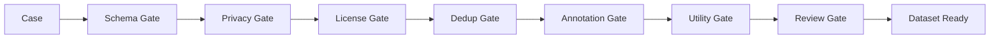
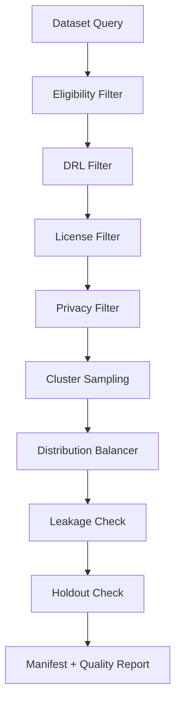

# Lodia 技术方案深度评估与数据质量保障设计

版本：v0.2  
日期：2026-05-05  
关联文档：

- [LODIA_PRD.md](./LODIA_PRD.md)
- [LODIA_TECH_ARCHITECTURE.md](./LODIA_TECH_ARCHITECTURE.md)

品牌说明：Lodia 是主品牌，Inbox 只是数据采集入口。本文评估对象是 Lodia 作为 AI Case-to-Dataset 数据资产平台的完整技术方案，而不是单一邮箱产品。

## 1. 评估结论

当前技术方案的大方向成立：用低摩擦入口收集 AI 对话和任务记录，再通过隔离、脱敏、去重、标注、审核、账本和数据集生成，把 Case 转化为数据资产。

但方案存在一个关键风险：**自动标注的数据很可能不可直接商用、不可直接训练、不可直接作为 gold eval。**

原因不是自动化不够先进，而是 AI 对话和任务记录天然存在以下问题：

- 原始数据不完整，缺少上下文、真实结果和验收反馈。
- AI 回答可能错误，但表面很流畅。
- 自动脱敏可能破坏业务语义，导致样本不可用。
- 自动标注可能误判领域、任务类型、正确性和可复用性。
- 重复、改写、搬运、刷量数据会污染数据集。
- 数据授权、隐私、版权和平台条款可能不满足商用。
- 数据可能被投毒，包含错误答案、后门指令或误导性 eval。
- 多模态解析存在 OCR、ASR、截图遮挡和附件解析错误。

所以 Lodia 必须从“自动标注平台”升级为 **数据质量生产线**：

```text
自动预处理
-> 自动预标注
-> 质量门禁
-> 风险门禁
-> 抽检/人审
-> 数据分级
-> 持续评测
-> 使用反馈回流
```

推荐原则：

> 自动标注只能生成候选标签；只有通过质量门禁和审核的数据，才能进入可商用数据集、gold eval 或训练集。

## 2. 技术方案主要问题

### 2.1 MVP 范围偏大

当前技术方案同时覆盖：

- 邮件入口
- 上传入口
- API/MCP
- 多模态处理
- 原始隔离
- 自动脱敏
- 去重聚类
- 自动标注
- 人工审核
- 数据集导出
- 使用账本
- 分账

这些模块都重要，但如果 MVP 一次性全部实现，交付风险较高。建议 MVP 只跑通最小可信闭环：

```text
邮件/上传
-> 原始隔离
-> 文本/PDF/图片基础解析
-> 自动脱敏
-> Case 标准化
-> 自动预标注
-> 人审确认
-> 数据集导出
-> UsageEvent
```

暂缓：

- 视频深度处理
- 自动分账
- 开放市场
- 复杂 MCP 能力
- 完整企业私有化
- 训练使用分账

### 2.2 自动标注质量被低估

自动标注不是简单分类。Lodia 需要判断：

- 这个问题是否真实？
- 回答是否正确？
- 任务是否完成？
- 是否有可验证结果？
- 是否适合训练？
- 是否适合作为 eval？
- 是否包含隐性隐私？
- 是否与已有 Case 重复？
- 是否会污染下游模型？

这些判断无法完全靠一次 LLM 调用完成。尤其是“答案正确性”“任务完成度”“可作为 gold sample”需要证据，而不是模型自信。

### 2.3 脱敏可能损害数据可用性

脱敏越强，隐私越安全，但数据价值可能下降。比如：

```text
原始：某跨境电商客户在德国站 VAT 申报失败，原因是税号和店铺主体不一致。
过度脱敏：[ORG_1] 在 [COUNTRY_1] [BUSINESS_1] 申报失败，原因是 [ID_1] 和 [ENTITY_1] 不一致。
```

过度脱敏后，样本可能失去行业、地区、合规和业务语义，无法用于垂直 eval。

因此脱敏需要支持语义保留：

- 人名、电话、邮箱强脱敏
- 公司名替换但保留行业属性
- 金额区间化而非删除
- 地址降精度
- 地区和国家可按风险保留
- 业务类型尽量保留
- 法律/财税/跨境等场景保留必要抽象标签

### 2.4 “匿名化”目标过高

严格匿名化很难保证，尤其是行业案例、时间、职位、地区、金额组合后可能重识别。Lodia 更现实的目标应是：

- 默认去标识化和脱敏
- 高风险场景拒收或仅私有使用
- 公开/商用数据集增加重识别风险检测
- 不宣传“绝对匿名”

NIST 对去标识化的描述也强调，它不是单一技术，而是一组方法；隐私保护增强通常会牺牲数据效用。

### 2.5 多模态处理复杂度被低估

图片、PDF、音频、视频都可能携带隐私和业务关键证据。

风险包括：

- OCR 漏识别截图中的手机号、邮箱、公司名
- PDF 表格结构抽错，导致金额、字段、行列对应关系错误
- 音频 ASR 识别错误，改变语义
- 视频关键帧抽样漏掉敏感画面
- EXIF、文件名、路径、压缩包目录暴露身份
- 图片打码区域坐标错误

结论：MVP 可以支持多模态上传，但不要承诺多模态自动标注高质量。第一阶段应只把多模态内容作为辅助证据，进入人审或低等级数据资产。

### 2.6 Postgres + pgvector 可用于 MVP，但不应承诺大规模

Postgres + pgvector 非常适合 MVP 和早期商业化。但当进入百万级/千万级 Case、跨租户高并发检索、频繁聚类更新时，会遇到：

- 向量索引膨胀
- metadata filter 性能下降
- 分区和向量索引协同复杂
- 大租户影响小租户
- 聚类更新导致写放大

建议架构文档中保留“pgvector 起步”，同时明确迁移触发条件：

- 单租户向量超过 300 万条
- P95 向量检索 > 500ms
- 聚类任务积压超过 30 分钟
- Postgres CPU 长期 > 70%
- 数据集搜索和业务写入互相影响

### 2.7 Usage Ledger 需要更强一致性设计

UsageEvent 关系到分账，不能只作为普通业务日志。

风险：

- 数据集导出成功但 UsageEvent 写失败
- UsageEvent 重复写导致重复分账
- Case 撤回后旧 manifest 仍被误用于新导出
- 买方 API 调用未正确记录 CaseID
- 异步重试导致账本顺序混乱

建议：

- UsageEvent append-only
- 强制 idempotency key
- 数据集导出和 UsageEvent 采用同一个导出任务事务状态
- 导出文件 manifest hash 写入 UsageEvent
- 分账使用账期快照，不直接读实时业务表
- 所有可计费事件进入 reconciliation 对账流程

### 2.8 人审会成为瓶颈

如果所有高价值、高风险、近重复、低置信 Case 都进入人工审核，审核队列会迅速积压。

需要在产品上分级：

| 数据等级 | 是否必须人审 | 用途 |
| --- | --- | --- |
| DRL0 Raw | 不可用 | 原始隔离 |
| DRL1 Machine Parsed | 否 | 用户私有预览 |
| DRL2 Machine Labeled | 抽检 | 私有库、低风险内部分析 |
| DRL3 Reviewed | 是 | 普通数据集 |
| DRL4 Expert Verified | 是，领域专家 | 训练集、高价值行业数据 |
| DRL5 Gold Eval | 双人审核 + 争议仲裁 | gold benchmark |

不要让所有数据都走最高等级，否则系统不可运营。

## 3. 自动标注数据不可用的典型情况

### 3.1 没有正确答案

很多 AI 对话只有问题和回答，没有用户反馈、执行结果或外部验证。此类数据可以做案例库，但不应做 gold eval。

处理：

- 标记为 `answer_unverified`
- 只能进入 `case_library_candidate`
- 不能进入 `gold_eval`
- 训练用途需要额外审核

### 3.2 回答看似优质但实际错误

LLM 很容易把格式清晰、语气肯定的错误答案打成高质量。

处理：

- 对代码类 Case 要求测试结果或 diff 证据
- 对财税/法务类 Case 要求专家审核
- 对事实类 Case 要求来源引用或检索验证
- 对流程执行类 Case 要求最终状态证据

### 3.3 上下文缺失

只有一段回答，没有原始任务目标、约束、文件、工具结果或用户反馈，无法复用。

处理：

- 标记为 `context_incomplete`
- 降低完整度分
- 提示贡献者补充上下文
- 不进入训练集

### 3.4 脱敏后语义被破坏

脱敏把行业、地区、角色、金额、错误码等关键特征删除，导致数据不可用。

处理：

- 引入 `utility_after_redaction_score`
- 脱敏后再做可用性评估
- 允许保留安全的业务属性
- 高价值样本进入人工脱敏优化

### 3.5 自动标签错误

例如把“客服投诉处理”标成“销售线索跟进”，或把“失败案例”标成“成功案例”。

处理：

- 多模型交叉标注
- 标签置信度阈值
- 低置信进入人审
- 按标签维度统计人工修改率
- 对高错误标签回滚 prompt 和模型版本

### 3.6 重复数据污染

大量相似问题会让数据集看似很大，实际覆盖面很窄。

处理：

- 数据集构建时按 cluster 采样
- 限制同一 cluster 占比
- 保留高频指标，但不要重复塞进训练集
- eval 集需要覆盖多 cluster，而不是多重复样本

### 3.7 数据投毒和刷量

贡献者为了收益可能提交伪造、高重复、诱导性或恶意样本。

处理：

- 贡献者信誉分
- 来源可信度分
- 异常提交检测
- 标注一致性检测
- 高收益 Case 延迟结算
- 黑名单和申诉机制

### 3.8 Eval 污染

同一 Case 既进入训练集又进入评测集，会导致模型评测虚高。

处理：

- dataset split ledger
- 每个 Case 标记用途集合
- gold eval 与训练集物理隔离
- 导出前做 overlap check
- 同 cluster 的相似样本也要隔离

### 3.9 授权不可用

数据内容质量很高，但贡献者没有权利商用授权。

处理：

- license gate 独立于 quality gate
- 授权不清的数据只能私有保存
- 企业域名/客户邮件/群聊记录默认高风险
- 商用前必须保留授权版本

### 3.10 多模态证据不可验证

截图、录屏、音频可能解析失败或缺失关键帧，导致结构化标注不可信。

处理：

- `asset_extraction_confidence`
- 低置信附件不作为答案正确性证据
- 多模态 gold sample 必须人工复核

## 4. 数据质量保障体系

### 4.1 数据可用等级 DRL

建议引入 Data Readiness Level：

| 等级 | 名称 | 标准 | 可用用途 |
| --- | --- | --- | --- |
| DRL0 | Raw | 原始隔离，未脱敏 | 不可使用 |
| DRL1 | Redacted | 已脱敏，未完整标注 | 个人私有库 |
| DRL2 | Auto Labeled | 自动标注通过，未人审 | 内部检索、候选数据 |
| DRL3 | Reviewed | 人工审核通过 | 普通案例库、普通数据集 |
| DRL4 | Verified | 领域专家确认 | 训练集、高价值行业包 |
| DRL5 | Gold | 双人审核、可验证答案、争议仲裁 | gold eval、benchmark |

产品规则：

- 自动标注最高只能到 DRL2。
- 普通商用数据集至少 DRL3。
- 训练集建议 DRL3 起，高风险行业 DRL4 起。
- gold eval 必须 DRL5。

### 4.2 七道质量门禁



#### Schema Gate

检查：

- 是否有用户问题
- 是否有 AI 回答或任务结果
- 是否能分轮次
- 是否有语言、来源、提交人、时间
- 附件是否可解析

失败处理：

- `invalid_schema`
- 提示贡献者补充

#### Privacy Gate

检查：

- 残留 PII
- 密钥
- 商业机密
- 重识别风险

失败处理：

- 拒收
- 仅私有
- 安全复核

#### License Gate

检查：

- 贡献者授权
- 来源平台限制
- 是否涉及第三方
- 是否允许商用、训练、评测、展示

失败处理：

- 限制用途
- 请求补充授权

#### Dedup Gate

检查：

- exact duplicate
- canonical duplicate
- semantic duplicate
- same cluster saturation

失败处理：

- 降权
- 合并
- 标记版本更新

#### Annotation Gate

检查：

- 标签置信度
- 多模型一致性
- JSON schema
- 标签与内容一致性

失败处理：

- 进入人审
- 降级为 DRL1/DRL2

#### Utility Gate

检查：

- 脱敏后是否仍有业务价值
- 是否有完整上下文
- 是否可形成 instruction/input/output
- 是否有验证证据

失败处理：

- 仅案例库
- 不进训练/eval

#### Review Gate

检查：

- 人审结论
- 专家审核
- 抽检状态
- 争议仲裁

失败处理：

- 降级
- 退回补充
- 拒绝商用

### 4.3 自动标注可信度设计

不要只保存一个 `quality_score`。建议拆成：

```json
{
  "label_confidence": 0.91,
  "answer_correctness_confidence": 0.42,
  "schema_completeness_score": 0.83,
  "redaction_utility_score": 0.76,
  "reuse_score": 0.68,
  "eval_readiness_score": 0.21,
  "training_readiness_score": 0.55,
  "commercial_readiness_score": 0.49
}
```

这样可以避免“综合分很高，但其实不能做 eval”的问题。

### 4.4 多模型和规则交叉验证

自动标注建议至少三路信号：

1. 规则和 taxonomy 分类
2. 主标注模型
3. 验证模型或 critic 模型

一致性策略：

| 情况 | 动作 |
| --- | --- |
| 三路一致且高置信 | 进入 DRL2 |
| 主模型和验证模型冲突 | 人审 |
| 规则与模型冲突 | 人审或降级 |
| 高价值高风险 | 必须人审 |
| gold 候选 | 双人审核 |

### 4.5 抽检机制

建议按风险和价值动态抽检：

| 数据类型 | 抽检比例 |
| --- | --- |
| 普通 DRL2 | 5% - 10% |
| 高价值候选 | 30% - 50% |
| 高风险行业 | 100% |
| 新贡献者提交 | 30% 起 |
| 高信誉贡献者 | 5% - 10% |
| 模型/规则刚更新后 | 提高到 20% - 30% |

抽检指标：

- 标签准确率
- 脱敏残留率
- 过度脱敏率
- 可用性误判率
- gold 误收率
- 训练集不适用率

## 5. 高质量数据集生成策略

### 5.1 数据集不是简单筛选 Case

高质量数据集需要控制分布：

- 按领域分布
- 按任务类型分布
- 按难度分布
- 按语言分布
- 按成功/失败分布
- 按 cluster 去重
- 按贡献者去重
- 按时间去重
- 按来源平台去重

否则数据集可能“看起来很大，实际很窄”。

### 5.2 数据集构建流程



### 5.3 数据集质量报告

每个数据集交付时必须包含：

- Case 数量
- DRL 分布
- 领域分布
- 任务类型分布
- 难度分布
- 语言分布
- 来源分布
- 去重策略
- cluster 数量
- 人审比例
- gold 比例
- 脱敏策略
- 授权范围
- 禁止用途
- 已知限制

### 5.4 Eval 集特殊要求

Eval 数据集比训练集更严格：

- 必须有明确输入和期望输出
- 必须有评分标准
- 必须有答案依据
- 不能与训练集重叠
- 同 cluster 近似样本也要排除
- 版本不可随意变动
- 每次评测记录模型、prompt、工具版本

### 5.5 训练集特殊要求

训练集重点不是“答案漂亮”，而是：

- 指令清晰
- 输入完整
- 输出正确
- 格式稳定
- 无隐私残留
- 无版权/授权问题
- 分布均衡
- 去重充分
- 不含 eval holdout

## 6. 高可用架构评估与改进

### 6.1 当前架构可用性优点

已有方案中的优点：

- Ingestion 与重处理解耦
- Raw Quarantine 降低隐私污染范围
- Outbox Pattern 降低事件丢失风险
- worker pool 可横向扩展
- Usage Ledger append-only 适合审计
- 多模态任务可按队列拆分

这些是正确方向。

### 6.2 当前高可用缺口

| 缺口 | 风险 | 建议 |
| --- | --- | --- |
| 没有明确 SLO 分层 | 所有功能都想高可用，成本过高 | 区分接收、处理、导出、市场的 SLO |
| Quarantine 单点风险 | 原始数据无法读写会阻断全部流程 | 多 AZ 对象存储、降级接收、延迟处理 |
| Redis/RabbitMQ 早期可能成为瓶颈 | 队列积压导致处理延迟 | 按任务类型拆队列，监控 lag |
| 模型供应商不稳定 | 标注/脱敏判断延迟 | Model Gateway fallback |
| OCR/ASR 积压 | 多模态任务拖垮文本任务 | 专用队列和优先级 |
| 向量库不可用 | 去重聚类延迟 | hash 去重先行，embedding 后补 |
| 人审队列积压 | 高价值数据不能出库 | 风险分层、抽检、专家池 |
| TTL 删除失败 | 合规风险 | 删除任务双通道和告警 |

### 6.3 SLO 分层

| 能力 | 推荐 SLO | 说明 |
| --- | --- | --- |
| Ingestion 接收 | 99.9% | 核心入口，必须高可用 |
| 状态查询 | 99.9% | 用户需要知道处理进度 |
| 文本脱敏处理 | 99.5% | 可异步，但不能长期积压 |
| 自动标注 | 99% | 可延迟处理 |
| OCR/ASR | 98% | 可降级 |
| 数据集导出 | 99% | 异步任务 |
| 市场浏览 | 99.5% | 商业化后提高 |
| 分账计算 | 99% | 可账期批处理 |

### 6.4 降级策略

| 故障 | 降级方式 |
| --- | --- |
| LLM 不可用 | Case 保持 redacted 状态，标注延迟 |
| OCR 不可用 | 文本 Case 正常，多模态 asset 标记 pending |
| ASR 不可用 | 音频 Case 暂不进入数据集 |
| 向量检索不可用 | 只做 hash/canonical 去重 |
| 人审积压 | 降低新 Case 商用出库速度，不影响私有库 |
| 数据集导出失败 | 保留任务，可重试，不重复计费 |
| UsageEvent 写入失败 | 导出不标记完成，进入 reconciliation |

### 6.5 背压和优先级

队列优先级建议：

1. 安全删除和撤回
2. 隐私脱敏和残留扫描
3. 文本 Case 标准化
4. 付费客户导出
5. 自动标注
6. embedding 和聚类
7. OCR/ASR/视频
8. 低价值批量重算

原则：

- 隐私和删除优先于增长。
- 文本主链路优先于多模态深处理。
- 付费客户导出优先于后台优化。
- 低价值 Case 不应消耗昂贵模型资源。

## 7. 需要补充到技术架构中的关键模块

### 7.1 Quality Gate Service

独立服务，负责：

- 数据可用等级 DRL 判定
- 质量门禁
- 数据集准入
- 抽检策略
- 质量报告生成

### 7.2 Evaluation Harness

用于评估自动标注和数据集质量：

- 固定 gold set
- 标注模型回归测试
- 脱敏规则回归测试
- 去重阈值回归测试
- prompt 版本对比
- 数据集泄漏检测

### 7.3 Data Contract Registry

每一种数据集都有 data contract：

- 必填字段
- 标签枚举
- 质量阈值
- DRL 要求
- 授权要求
- 禁止用途
- 导出格式
- 版本兼容性

### 7.4 Reconciliation Service

负责账本对账：

- 导出文件与 UsageEvent 对账
- 购买订单与 UsageEvent 对账
- UsageEvent 与 PayoutEvent 对账
- 撤回 Case 与 Dataset Manifest 对账
- 异常账单冻结

### 7.5 Source Trust Scoring

来源可信度评分：

- 贡献者历史质量
- 平台来源
- 是否有原始 trace
- 是否有用户反馈
- 是否有执行结果
- 是否来自企业认证空间
- 是否曾被判定刷量

来源可信度应影响审核优先级和收益释放速度。

## 8. 数据质量指标体系

### 8.1 自动标注指标

- 标签准确率
- 标签召回率
- 人审修改率
- 多模型一致率
- JSON schema 通过率
- 低置信占比
- 标注成本 / Case
- 标注延迟 P95

### 8.2 脱敏质量指标

- PII 召回率
- PII 精确率
- 残留隐私事件数
- 过度脱敏率
- 脱敏后可用性分
- 高风险拒收准确率
- 安全复核通过率

### 8.3 数据集质量指标

- usable case yield
- DRL3+ 占比
- DRL5 占比
- cluster 覆盖数
- 重复率
- 领域覆盖率
- eval leakage rate
- 客户退货/投诉率
- 下游评测收益

### 8.4 高可用指标

- ingestion success rate
- queue lag by topic
- worker success rate
- dead letter rate
- retry rate
- raw TTL deletion lag
- export success rate
- usage event reconciliation mismatch
- model provider error rate
- cost per processed case

## 9. 推荐修订后的处理流程

建议将原流程升级为：

```text
1. Ingestion accepted
2. Raw Quarantine
3. File safety scan
4. Evidence extraction
5. Redaction
6. Residual risk scan
7. Case normalization
8. Schema gate
9. License gate
10. Dedup and cluster
11. Auto annotation
12. Utility scoring
13. Quality gate
14. Review routing
15. DRL assignment
16. Asset registry
17. Dataset contract check
18. Dataset manifest
19. Usage ledger
20. Payout reconciliation
```

关键变化：

- 在自动标注后增加 Utility scoring 和 Quality gate。
- 在数据集生成前增加 Dataset contract check。
- 将 DRL 作为数据可用等级，不让自动标注直接进入商用。
- 将账本和分账增加 reconciliation。

## 10. 对现有架构文档的具体修改建议

建议在 [LODIA_TECH_ARCHITECTURE.md](./LODIA_TECH_ARCHITECTURE.md) 中补充：

1. 在总体架构中加入 `Quality Gate Service`。
2. 在自动标注后加入 `Utility Scorer` 和 `DRL Assigner`。
3. 在 Dataset Builder 前加入 `Dataset Contract Checker`。
4. 在 Usage Ledger 后加入 `Reconciliation Service`。
5. 在指标体系中新增数据质量指标。
6. 在 ADR 中新增“自动标注不能直接产生商用数据”的决策。
7. 在多模态章节中明确 MVP 多模态只作为辅助证据，gold 样本必须人审。
8. 在去重章节中增加 eval/train split 的同 cluster 泄漏检查。
9. 在脱敏章节中增加 `redaction_utility_score`。
10. 在高可用章节中增加 SLO 分层和背压优先级。

## 11. 建议新增 ADR

### ADR-007：自动标注只作为预标注，不直接进入商用数据集

决策：

自动标注结果最高只能将 Case 提升到 DRL2。普通商用数据集至少需要 DRL3，gold eval 必须 DRL5。

理由：

- 自动标注无法可靠判断答案正确性和任务完成度。
- 自动脱敏可能损害数据可用性。
- 数据投毒、授权不清和重复刷量会污染下游数据集。

代价：

- 人审和抽检成本增加。
- 数据出库速度下降。

收益：

- 数据可信度更高。
- 客户更容易接受。
- 分账争议和质量事故减少。

### ADR-008：引入 Data Readiness Level 作为数据资产准入标准

决策：

每条 Case 都必须有 DRL 等级。不同产品用途对应不同最低 DRL。

理由：

- 数据用途差异很大，不能用一个质量分覆盖。
- 训练、评测、案例库、私有检索的准入标准不同。

最低标准：

- 私有库：DRL1
- 候选库：DRL2
- 普通商用数据集：DRL3
- 训练集：DRL3/DRL4
- gold eval：DRL5

### ADR-009：数据集必须有 Data Contract 和 Quality Report

决策：

每个数据集导出前必须通过 Data Contract 检查，并生成 Quality Report。

理由：

- 买方需要知道数据能用于什么、不能用于什么。
- 数据分布和限制比样本数量更重要。
- 质量报告能减少交付争议。

## 12. 总体判断

Lodia 的技术方案可以成立，但必须修正一个核心假设：

> 自动化处理可以提高数据生产效率，但不能替代数据质量治理。

自动化标注的数据当然存在不可用的可能，而且早期不可用比例可能不低。真正的产品能力不是“自动标注很准”，而是：

- 能识别哪些数据不可用
- 能解释为什么不可用
- 能把可用数据分级
- 能让高价值数据通过审核升级
- 能持续监控标注质量和数据集效果
- 能让客户只购买适合其用途的数据

推荐最终质量策略：

```text
自动化负责规模
规则负责底线
人审负责可信
评测负责闭环
账本负责追踪
分级负责可用
```

如果 Lodia 能把这套质量生产线做好，它的护城河会比“邮箱入口”和“自动标注”都更强。

## 13. 参考资料

- [OWASP Top 10 for Large Language Model Applications](https://owasp.org/www-project-top-10-for-large-language-model-applications/)
- [NIST AI Risk Management Framework](https://airc.nist.gov/airmf-resources/airmf/)
- [NIST Deidentification](https://www.nist.gov/itl/iad/deidentification)
